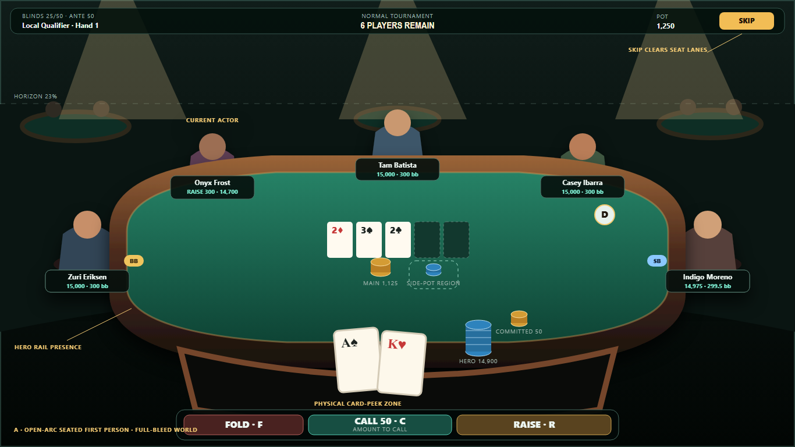
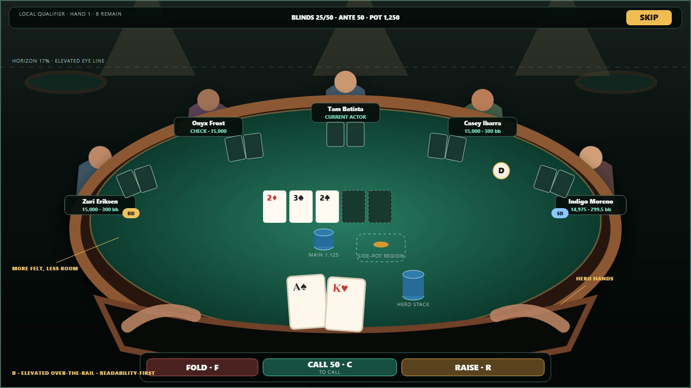
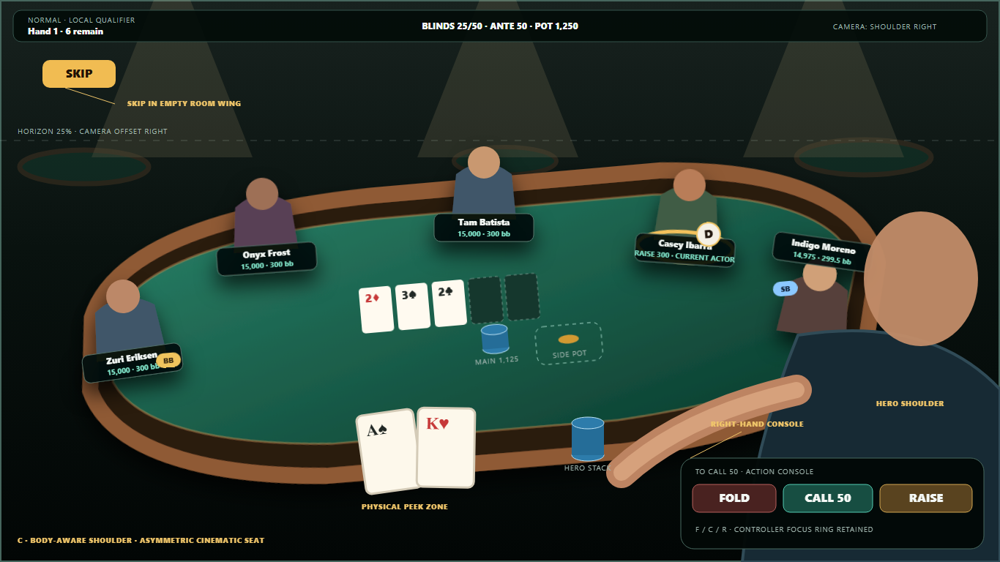

# Desktop 3D seated-table composition decision

**Status:** proposed design gate; production implementation is not authorized by
this document alone

**Decision owner:** Poker Training Pro design review

**Implementation owner after approval:** Tera

**Backlog gate:** D3D-M103 remains open

**Evidence baseline:** `main` at `fec5269`, 2026-07-29

## Decision summary

Approve **Direction A — Open-arc seated first person** for production
implementation.

Direction A is the only option that fixes all three structural causes together:
the full circular seat ring, the dashboard-sized scene viewport, and the lack of
a physical hero foreground. It replaces the circular table with a capsule table,
places all five opponents on a forward horseshoe, makes the 3D room full-bleed,
and moves poker objects into the world while retaining a narrow screen-space
action band and the authoritative DOM accessibility mirror.

The prior M103 work proved camera input, lifecycle, public-state projection,
fallback restoration, and native-window capture. It did **not** prove a coherent
composition. Automated presence and bounds checks passed while three native
framings still looked wrong. This decision changes the composition model rather
than asking for a fourth adjustment to the same model.

## Evidence inspected

The following were read or inspected before making this decision:

- `TODOS.md`, including the complete M103 evidence chain and all preserved
  caveats;
- `docs/desktop-3d-architecture.md`;
- `docs/desktop-3d-implementation-plan.md`, especially D3D-M103 and its
  dependencies;
- M103 commits from `bac2c11` through `fec5269`, including the camera, scene-ready
  DOM contract, native-window harness, compact card-lane work, residual DOM
  diagnosis, seat-envelope experiment, and final strategy-limit record;
- current `tableSceneModel.ts`, `tableScene.ts`, `tableSceneSnapshot.ts`,
  `TableScene3D.tsx`, `PokerTable.tsx`, and the related CSS and tests;
- native packaged 1024×768, 1366×768, and 1920×1080 captures;
- recovered r10, r12, and r13 packaged captures at the same native 1366×768
  target;
- `work/packaged-3d-scene-audit.json`, including renderer diagnostics, public
  object parity, context recovery, and the native composition matrix.

The latest matrix proved a visible decorative canvas, six mounted seat labels,
transparent duplicate DOM furniture, public board parity, stable resources
through context recovery, and comfortable performance on the development GPU.
At 1366×768 it recorded 136 draw calls, 6,942 triangles, 226 resources, and
5.6 ms p95. Those are valuable engineering gates, but none measures perceived
scale, spatial hierarchy, or whether the result reads as a game rather than a
dashboard.

## What the current composition actually does

The current world is not full-screen. `.table-layout` reserves a permanent
330 px side panel (290 px below 1250 px), while `.poker-scene` also reserves
150 px at the bottom for the action/status dock. The result is a 3D room drawn
inside a bordered dashboard cell.

The 3D table is a circle with radius 1.35 m and height 0.78 m. Six seats are
spaced uniformly around the full circle at radius 1.77 m. The hero body is
hidden, but the other five chair/body roots keep their full-ring positions.
The camera eye is 1.24 m high and only 0.47–0.97 m outside the rail, looking
down roughly 13–16 degrees. The two adjacent seats therefore sit much closer to
the lens than the far seats and near the left/right frustum boundaries.

The hero's visible cards remain fixed-size DOM cards at the bottom of the scene,
while a 3D copy also exists on the felt. Opponent labels, the large central Skip
button, the bottom status/action dock, top camera controls, and the persistent
side panel all read as screen furniture laid over the room. The primitive room
itself is a floor plane plus four empty distant tables; at 1920×1080 the extra
vertical area becomes a dark void rather than useful environmental context.

## Why the three M103 attempts failed

### Attempt 1 — Retreat every camera preset by 0.40 m

[Native r10 camera-retreat capture](./design/3d-composition-reset/failed-01-camera-retreat-r10-1366x768.png)

**Observed symptom:** side-edge chair/head shapes remained, while the table,
cards, and opponents became smaller and more remote.

**Composition defect:** the change treated the symptom as a camera-distance
problem. The r10 capture was also contaminated by 6% residual DOM figures,
which were later correctly diagnosed and removed. After that residue was
removed, real physical side-seat clipping still remained.

**Root cause:** a full circular seat ring places the two adjacent opponents near
the lens and near the horizontal frustum boundary. Moving the camera backward
does not change that angular relationship. It also weakens the intended close
hero cards and chips, increases the gap between the hero and the rail, and makes
the boxed dashboard viewport more obvious.

**Why tests passed:** the camera preset hierarchy, ±28-degree clamp, input
parity, lifecycle, and DOM mounting were all still correct. None of those tests
asked whether the table retained believable physical scale.

### Attempt 2 — Move chair roots from 0.42 m to 0.20 m outside the rail

[Native r12 seat-envelope capture](./design/3d-composition-reset/failed-02-seat-envelope-r12-1366x768.png)

**Observed symptom:** the lateral bodies moved inward but remained oversized and
intersected the visual frame. Cards and chips stayed at their old felt anchors,
making the character/object relationship less convincing.

**Composition defect:** the experiment changed chair clearance but retained the
circular table, uniform six-seat arc, near-level eye line, same body scale, same
camera target, and same dashboard-shaped scene viewport.

**Root cause:** the side opponents are not merely too far from the rail; they
occupy the wrong angular positions for this first-person camera. Their distance
from the lens and projected scale remain materially different from the three far
opponents. Pulling chairs toward the table cannot make a full 360-degree ring
read as a five-opponent forward composition.

**Why tests passed:** the pure seat model can verify deterministic positions and
stable player-ID reconciliation. It cannot decide that a seated body is too
large in the final native frame or that cards and chips no longer feel attached
to that body.

### Attempt 3 — Widen FOV from 52/58/64 to 62/68/74 degrees

[Native r13 wide-FOV capture](./design/3d-composition-reset/failed-03-wide-fov-r13-1366x768.png)

**Observed symptom:** more geometry entered the frame, but side bodies and chairs
became more distorted, the rail bowed more aggressively, the hero foreground
felt farther away, and the composition looked less coherent.

**Composition defect:** the wider lens used perspective distortion to fit a seat
layout that was designed for neither a wide lens nor a boxed scene viewport.
The large top void and persistent screen panels remained untouched.

**Root cause:** field of view cannot solve the combined seat-arc, table-shape,
hero-presence, and UI-division problem. It changes every object's apparent
scale while leaving the underlying spatial hierarchy wrong.

**Why tests passed:** FOV values were deterministic, ordered, and inside the
same pan clamp. The production build and native audit verified operability and
presence, not distortion or visual hierarchy.

## Shared root-cause analysis

| Symptom | Immediate defect | Root cause |
|---|---|---|
| Side heads/chairs intersect frame | Adjacent full-ring seats are near the lens and frustum edge | Circular table plus uniform 360-degree seat arc is incompatible with this first-person framing |
| Table alternates between too large and too remote | Camera distance/FOV is compensating for geometry | No composition-level contract relates table dimensions, seat arc, body envelope, and usable viewport |
| Hero cards look pasted on | Fixed DOM cards sit over a separate 3D copy | Hero has no physical foreground contract or explicit world/screen ownership |
| Current actor halo becomes a cropped ellipse | Floor ring follows a chair outside the useful frame | Actor treatment assumes every chair is comfortably visible |
| 1920×1080 shows a large black band | Camera pitch/target and sparse room leave unused upper frame | Environment framing was never designed; the room is a diagnostic shell |
| 1024/1366 feels cramped despite a wide lens | Scene shares width with a permanent side panel and height with a 150 px dock | Desktop remains a dashboard grid with 3D inserted into one cell |
| Skip and labels obscure players | Screen overlays occupy the same central lanes as bodies | No safe-area plan divides world-space poker state from screen-space controls |
| Automated matrix passes but visual review fails | Harness checks presence, opacity, parity, and bounds | Acceptance lacks perceptual scale, occlusion, horizon, and game-versus-GUI criteria |

The failed framing is therefore not one bad camera constant. It is one coupled
composition system: viewport division → camera → table shape → seat arc →
character envelope → hero foreground → HUD safe areas.

---

## Direction A — Open-arc seated first person

[Editable SVG](./design/3d-composition-reset/direction-a-open-arc-1366x768.svg)

### A. Player experience

The player sits at the open side of a capsule poker table. The near rail,
physical hero cards, hero chips, and a small amount of floor/seat context form
the foreground. All five opponents occupy a forward horseshoe rather than a
full circular ring. The room continues behind them with a deliberate horizon,
light cones, and distant tables.

The composition should feel like looking out from a real seat: close objects are
large but not screen overlays; adjacent opponents are still in front of the
player rather than beside or behind the lens; looking left or right reveals room
wings without turning the camera into a spectator orbit.

### B. Camera specification

| Property | Production start target |
|---|---|
| Vertical FOV | fixed 52° in every responsive and preference mode |
| Camera eye height | 1.24–1.29 m; start 1.26 m |
| Distance behind near rail | Responsive closest safe position; original 0.78–0.96 m / `z=1.66` is the preferred close pose, not a fixed coordinate |
| Camera position | `(0, 1.26, z)`; centered, with `z` solved per native safe frame |
| Recenter target | centered on `(0, z=-0.18)`; target height is solved to retain the seated pitch as depth changes |
| Pitch | fixed −16° seated gaze as responsive depth changes |
| Look limits | yaw −32° left / +32° right; pitch fixed during ordinary play |
| Recenter | yaw 0°, pitch −16°, 450–650 ms only when camera motion is full |
| Near/far clip | 0.05 m / 45 m |
| Current-actor attention | up to 5° yaw and 1.5° pitch over 450 ms; never while the hero acts or while the player is manually looking; return over 750 ms |

FOV is not a responsive-layout or view-preference substitute. **Approved
reconciliation, 2026-07-29:** preserve the table, seat anchors, horizontal
center, 1.26 m eye height, fixed 52° vertical FOV, physical hero foreground,
and 16 px safe rectangle; change **camera distance only**.
`open-arc-v1` solves the nearest centered depth in the preferred 1.66–2.25 m
range when it fits, but may extend to the measured 3.75 m safe-frame ceiling.
The solver takes the greater of the full chair/arm envelope and the fixed-size
capsule rail's approved apparent-width bound; at 1024×768 this is about 3.62 m.
At ultrawide widths it fits the table against the centered 1920 px gameplay
zone and exposes room wings rather than stretching the table. It never widens
FOV, scales the table, or removes foreground cards/chips merely to satisfy a
capture.

### C. Table and seat geometry

- Capsule/soft-rectangle table: **2.72 m wide × 1.42 m deep × 0.76 m high**.
  Rail width 0.12 m; padded vertical thickness 0.10 m.
- Hero anchor is centered on the open near side. No hero chair or skull renders
  through the lens.
- Five opponent chair roots, in metres relative to table center:
  `(-1.28, 0, 0.28)`, `(-1.16, 0, -0.55)`, `(0, 0, -0.84)`,
  `(1.16, 0, -0.55)`, `(1.28, 0, 0.28)`.
- Near-side opponent centers remain about 1.85–2.0 m from the eye; far opponents
  remain about 2.35–2.60 m away. This is a deliberate narrower depth ratio than
  the current circular ring.
- Seated character eye line: 1.16–1.24 m. Primitive bodies scale uniformly at
  1.0; individual final-body variation is limited to ±6%, never enough to break
  the envelope.
- Opponent cards and committed chips use five dedicated felt anchors paired with
  the chair roots. They are not derived by multiplying a circular radius.
- Dealer puck sits 0.20 m inside the rail at the owner seat. SB/BB markers sit
  beside the committed-chip lane, never above a face or nameplate.
- Main pot center: `(0, 0.78, 0.10)`. Community cards center at
  `(0, 0.785, -0.18)`. Side-pot lanes begin at x ±0.34 m and expand outward in
  0.22 m increments. Each lane has a physical pile and short amount plaque.

### D. Hero foreground

- Hero cards are physical 3D cards at x ±0.09 m, z 0.50 m, immediately inside
  the near rail. They are the only visually opaque hero-card representation
  while the scene is ready.
- Peek tilts the card pair 50–58° toward the camera and lifts the near edge
  0.10–0.12 m. The DOM button remains the hit target and accessibility owner; in
  ready mode its card paint is transparent except for a visible focus outline
  and a compact rank/suit text equivalent while peeked.
- Hero stack sits at `(0.46, 0.78, 0.48)`. Committed chips sit at
  `(0.43, 0.78, 0.20)` and physically travel to the appropriate pot lane.
- The action controls are screen-space because they must retain reliable hit
  targets and focus order. They occupy one bottom safe band, max 760×72 px at
  1366×768, below the critical felt.
- “Amount to call” is inside the Check/Call button as a secondary line. It is
  not a separate paragraph over the scene.
- Skip is a 44 px-high button in the top-right HUD safe area. It never covers
  the top-center actor.
- During spectator presentation, the action band collapses to a 44 px status
  ribbon with the 2× control secondary at the right.

World-space: hero cards, chips, committed bet, board, pots, button/blinds, actor
light, opponent cards, and character actions. Screen-space: minimum HUD, action
buttons, Skip, pause/settings, visible focus, and accessible text mirrors.

### E. Opponent readability

- All five bodies show head, torso, shoulders, both forearms/hands, and their
  physical relationship to cards and chips at recenter.
- A short rail/name plaque shows name and stack. The acting plaque adds
  action/amount for at least 1.5 seconds. The DOM retains the same text in seat
  groups and live regions.
- Current actor uses three redundant public cues: steady warm chair light,
  gold rim on the rail plaque, and the existing live announcement. Full motion
  may add the bounded attention move; reduced/off does not.
- Fold: hands move cards to the muck and the chair light dims.
- Check: hand taps felt; “CHECK” holds on the plaque.
- Call: exact chips move from committed lane to the pot path.
- Bet/raise: gathering and push paths remain distinct.
- All-in: the full committed pile moves and an “ALL IN” plaque remains until the
  pot is formed.
- Faces never sit behind a dealer puck, blind marker, card, action label, or
  screen control.

### F. Environment framing

At recenter, the horizon sits at 21–27% of viewport height and at least 12% of
the visible frame remains between the far opponent heads and the top HUD. M1 may
use procedural walls, floor, light cones, and three background table silhouettes
to establish scale; M3 can replace them with the authored room kit without
changing the foreground camera.

The room wings on left/right are intentionally useful. M3 can place multiple
populated tables and tier-specific fixtures there. M4 arrival and career routes
can end at the same hero camera anchor, so the seated view is the terminal pose
of travel rather than a separate composition.

### G. Responsive behavior

| Native target | Composition behavior |
|---|---|
| 1100×720 | No side panel. 48 px top HUD, 58 px action band. Fixed 52° lens; the centered depth solver uses the nearest safe pose. Seat plaques use two 11 px lines. |
| 1280×720 | Same compact-height bands and fixed 52° lens. The depth solver retains all five heads, plaques, cards, pots, and markers inside the world-safe rectangle. |
| 1366×768 | Reference composition uses the fixed 52° lens and the nearest centered safe depth. |
| 1920×1080 | Keep the table at 70–76% of viewport width rather than scaling it to fill every pixel. Use added room above and beside it at the same fixed 52° lens. Action band remains max 760 px. |
| 2560×1080 | Preserve the centered 1920 px gameplay safe zone and expose extra room wings. Do not stretch the table or spread seats. Optional secondary tournament information may occupy a collapsible wing drawer, never a permanent panel. |

The legacy 1024×768 package target uses the 1100×720 compact rules and the same
fixed 52° lens/state inventory. Its safe-frame solution may exceed the initial
2.25 m depth guide (currently about 3.62 m): visual containment and the capsule
rail's approved apparent width take priority over clipping a chair or widening
the lens. It is retained for the existing M103 matrix even though the product
target list starts at 1100×720.

### H. Accessibility and reduced motion

- Fixed-camera equivalent is exactly the recenter pose with no attention,
  interpolation, idle sway, or travel.
- Reduced camera motion snaps manual left/right steps to stable poses and renders
  on demand. Reduced table motion uses readable terminal poses and the same
  action/amount dwell.
- The canvas stays `aria-hidden` and unfocusable. DOM seat groups, cards,
  markers, pots, actions, focus management, and live regions remain
  authoritative.
- Ready-mode DOM visual mirrors are either placed in the defined HUD bands or
  visually hidden; they never remain as faint duplicate furniture.
- Keyboard/controller order: camera left, recenter, camera right; hero cards;
  Fold, Check/Call, Raise; Skip when present; History; pause/settings. Pointer,
  keyboard, and controller reach the same camera and action states.
- Every world-space cue has an accessible equivalent: actor → live region and
  `aria-current`; pot lane → named DOM group; marker → seat label; physical
  action → action announcement; hero peek → card button state.

### I. Advantages, risks, and asset implications

- **Strongest benefit:** solves lateral scale and clipping while increasing,
  rather than sacrificing, seated presence.
- **Major visual risk:** the capsule/open-arc table could look custom rather than
  conventional if proportions are exaggerated. Keep the 1.92:1 top ratio and
  validate against ordinary six-max table ergonomics.
- **Implementation complexity:** medium. It replaces camera/table/seat geometry
  and page composition but does not require a hero rig.
- **Asset requirements:** new capsule table mesh/primitive, five new seat
  anchors, near rail detail, basic room shell. Primitive bodies remain usable.
- **Performance:** neutral to better. Same five rendered opponent bodies, one
  hidden hero body, and fewer persistent DOM-painted objects; full-bleed canvas
  increases pixels but remains inside the existing DPR and frame budgets.
- **Character scalability:** clean. The forward arc reserves head, shoulders,
  arms, and chair envelopes sized for final modular bodies.

---

## Direction B — Elevated over-the-rail

[Editable SVG](./design/3d-composition-reset/direction-b-over-rail-1366x768.svg)

### A. Player experience

The camera remains at a seated location but rises above the rail and pitches
down enough to show most of the felt. The hero's forearms and near rail anchor
the bottom of the frame. All cards, bets, pots, and markers are unusually easy
to parse. The emotional tone is “at the table, leaning forward,” not overhead
spectator.

### B. Camera specification

| Property | Production start target |
|---|---|
| Vertical FOV | 48° standard; 44° close; 54° wide |
| Camera eye height | 1.44–1.54 m; start 1.49 m |
| Distance behind near rail | 0.58–0.76 m; start 0.68 m |
| Camera position | `(0, 1.49, 1.48)` |
| Recenter target | `(0, 0.76, -0.05)` |
| Pitch | −22° to −27°; start −24° |
| Look limits | yaw ±24°; pitch locked |
| Near/far clip | 0.05 m / 40 m |
| Current-actor attention | max 3° yaw over 400 ms; no pitch change |

### C. Table and seat geometry

- Oval table 2.58 m × 1.52 m × 0.76 m, padded rail 0.12 m.
- Hero remains centered at the near edge, with forearms visible but no torso or
  head mesh.
- Opponent roots follow an elliptical 240-degree forward arc:
  `(-1.24, 0, 0.34)`, `(-0.76, 0, -0.66)`, `(0, 0, -0.84)`,
  `(0.76, 0, -0.66)`, `(1.24, 0, 0.34)`.
- Character seated eye lines are 1.15–1.23 m; body scale ±5%.
- Board and pots use three explicit horizontal bands: opponent commitments,
  board, then main/side pots nearer the hero.
- Dealer/blind markers stay beside each seat's commitment band.

### D. Hero foreground

Hero cards lie 0.42 m inside the rail and peek by tilting toward the higher
camera. Hero stack stays near the right forearm; committed chips sit above it.
The action controls form a screen-space “command rail” below the physical rail.
Amount to call is inside Check/Call. Skip stays top-right. Only controls and HUD
enter screen space.

### E. Opponent readability

The higher pitch exposes every opponent hand, card lane, and committed bet.
Bodies are visible from waist up. Current actor uses a warm chair pool, rail
plaque, and DOM announcement. Recent action/amount stays on the plaque. All
physical actions use the same grammar as Direction A: receive/hold, fold/muck,
check tap, call placement, bet push, raise gather/push, all-in clear, and
win/collect. Face, card, stack, current actor, recent action, and amount are all
readable in one still, but the camera favors hand/object readability over facial
scale.

### F. Environment framing

The room occupies a shallower band: horizon at 15–20%, distant tables in the top
corners, and light fixtures above. M3 room atmosphere remains possible but less
prominent. M3 can add background players at multiple tables, warm casino
lighting, crowd-density changes, and tier-specific fixtures without changing
gameplay geometry. M4 arrival travel and career travel can both descend into
this “leaned forward” terminal pose; event-tier variation lives in the room
recipe, not in the camera.

### G. Responsive behavior

- 1100×720 and 1280×720 use FOV 52–54° and camera +0.10 m; the command rail is
  58 px high.
- 1366×768 uses the artifact values.
- 1920×1080 keeps the table at max 1,420 rendered pixels wide and exposes more
  room, not more felt.
- 2560×1080 keeps a centered 1920 px gameplay zone; extra room wings may host a
  collapsed information drawer.
- No target removes a seat, pot lane, marker, card, or action.

### H. Accessibility and reduced motion

The recenter pose is the fixed-camera equivalent. Reduced/off disables attention
and interpolated lean. DOM alignment is simpler than Direction A because the
felt bands are broad and stable, but the same authoritative DOM, focus order,
keyboard/controller parity, and world-cue equivalents are required.

### I. Advantages, risks, and asset implications

- **Strongest benefit:** highest poker-state readability and lowest chance of
  object occlusion.
- **Major visual risk:** can feel like a televised/tabletop view rather than a
  person seated in the room.
- **Implementation complexity:** medium-low.
- **Asset requirements:** oval table, hero forearms, revised seat anchors.
- **Performance:** slightly favorable because less room detail is visible.
- **Character scalability:** good; upper bodies and hands have generous space,
  but full-body room presence is less visible.

---

## Direction C — Body-aware shoulder

[Editable SVG](./design/3d-composition-reset/direction-c-shoulder-1366x768.svg)

### A. Player experience

The camera sits slightly behind and above the hero's right shoulder. A hero
shoulder, forearm, and hand frame the right foreground; cards sit close at lower
center-left. The table is angled and the action controls become a compact
right-hand rail console. This is the most cinematic and bodily of the options.

### B. Camera specification

| Property | Production start target |
|---|---|
| Vertical FOV | 46° standard; 42° close; 52° wide |
| Camera eye height | 1.30–1.38 m; start 1.34 m |
| Distance behind near rail | 0.82–1.02 m; start 0.92 m |
| Camera position | `(0.38, 1.34, 1.70)` |
| Recenter target | `(-0.08, 0.74, -0.14)` |
| Pitch | −13° to −17°; start −15° |
| Look limits | 38° left / 26° right from the asymmetric recenter |
| Near/far clip | 0.04 m / 45 m |
| Current-actor attention | max 4° yaw over 500 ms; blocked whenever the hero hand is interacting |

### C. Table and seat geometry

- Soft-capsule table 2.80 m × 1.38 m × 0.76 m, rotated visually about 5°.
- Hero seat is 0.24 m right of the table centerline to support the shoulder
  framing.
- Opponents use an asymmetric horseshoe, biased left to balance the hero body:
  `(-1.32, 0, 0.24)`, `(-1.04, 0, -0.56)`, `(-0.16, 0, -0.84)`,
  `(0.82, 0, -0.62)`, `(1.26, 0, 0.12)`.
- Character scale ±5%; near-right label sits above the head because the hero arm
  owns the lower-right lane.
- Board/pots are shifted 0.10 m left. Dealer and blind markers remain seat-local.

### D. Hero foreground

The hero shoulder, forearm, hand, cards, stack, and committed chips are all
world-space. The right-hand action console is screen-space and limited to a
414×124 px safe region. Amount to call appears inside it. Skip occupies the
empty upper-left room wing. The card-peek DOM control aligns with the lower-left
card pair and provides a visible focus outline.

### E. Opponent readability

Five faces remain visible at recenter, but the near-right opponent has the
tightest envelope. Current actor uses chair light and plaque plus accessible DOM
announcement. Cards and stacks remain seat-local; recent action and amount hold
on the plaque. Receive/hold, fold/muck, check, call, bet, raise, all-in, and
win/collect remain physically distinct. Actions are highly physical because the
hero hand can react, but opponent action/amount plaques must be authored around
the asymmetric lanes.

### F. Environment framing

The horizon sits at 22–28%. The offset camera creates strong room wings and a
natural endpoint for arrival travel. Background tables and event-tier lighting
can frame the hero silhouette; background players and crowd density can scale by
event tier. Warm casino lighting separates the hero silhouette from the room.
Arrival travel can approach from the aisle, while career travel approaches from
behind the hero seat and settles over the shoulder. Multiple background tables,
players, lighting, travel, and tier dressing remain room-recipe concerns rather
than gameplay-camera variants.

### G. Responsive behavior

- 1100×720 collapses the console to a 58 px bottom strip and reduces the hero
  shoulder silhouette by 18%; it never hides the near-right opponent.
- 1280×720 uses the compact console and 50° FOV.
- 1366×768 uses the artifact composition.
- 1920×1080 may show more hero torso and room but keeps the card pair in the
  same central safe zone.
- 2560×1080 expands the room wings; camera/table geometry does not stretch.

### H. Accessibility and reduced motion

Fixed mode uses the asymmetric recenter but removes hero breathing/idle motion,
attention, and camera interpolation. A static hero silhouette remains. The
authoritative DOM and focus order remain unchanged; console controls retain
44 px targets. Every world-space body/action cue has the same DOM text and live
announcement as the other options.

### I. Advantages, risks, and asset implications

- **Strongest benefit:** strongest physical identity and cinematic presence.
- **Major visual risk:** the hero body can occlude the near-right seat and makes
  left/right look asymmetric.
- **Implementation complexity:** high.
- **Asset requirements:** rigged hero torso, shoulder, hands, clothing variants,
  contact-aware card/chip clips, and asymmetric camera-safe animations.
- **Performance:** moderate extra skinning/animation cost and more foreground
  overdraw.
- **Character scalability:** opponents scale cleanly, but primitive geometry is
  a weak proxy for the final hero rig; composition approval would remain fragile
  until real hero-body assets exist.

## Comparative evaluation

Scores are 1 (weak/high risk) to 5 (strong/low risk). Implementation risk is
scored as ease of safe delivery.

| Criterion | A — Open arc | B — Over rail | C — Shoulder |
|---|---:|---:|---:|
| Seated physical presence | **5.0** | 3.8 | **5.0** |
| Poker-state readability | 4.5 | **5.0** | 3.7 |
| Left/right camera use | **5.0** | 4.0 | 3.2 |
| Future full-body characters | **5.0** | 4.3 | 3.5 |
| Room atmosphere | **5.0** | 3.6 | 4.6 |
| Minimal-GUI potential | **5.0** | 4.3 | 4.5 |
| Responsive behavior | **4.8** | 4.6 | 3.2 |
| Accessibility equivalence | 4.6 | **4.9** | 4.2 |
| Performance | 4.5 | **4.8** | 3.6 |
| Implementation risk | **4.2** | 4.5 | 2.4 |
| **Weighted total / 50** | **47.6** | 43.8 | 37.9 |

## Recommendation

**Recommend Direction A — Open-arc seated first person.**

It is more likely to pass native packaged review than the previous attempts
because it changes the angular relationship that produced the side-edge bodies,
removes the permanent side panel and 150 px world reduction, restores a physical
hero foreground, and gives the room a deliberate horizon. Camera distance and
FOV become final tuning inside a coherent geometry rather than compensation for
the wrong geometry.

It is preferred over Direction B because the product explicitly wants room
presence, look-left/look-right play, and future full bodies—not only excellent
felt readability. It is preferred over Direction C because it achieves nearly
the same seated presence without requiring a final-quality hero rig or accepting
asymmetric occlusion and responsive risk.

Approval should be for the complete Direction A contract. Approving only its
camera values while retaining the current circular table, full-ring seats, or
dashboard layout would recreate the same failure mode.

## Exact acceptance criteria for D3D-M103

M103 remains open until every item below passes against a fresh native package.

### Composition and physical scale

- [ ] Direction A is explicitly approved by the design owner before production
  implementation begins.
- [ ] The capsule table, forward five-seat horseshoe, full-bleed world, physical
  hero foreground, and HUD safe areas are implemented as one change set. No
  fourth tweak to the old circular/full-ring framing is accepted.
- [ ] At recenter, all five opponent heads, both hands/action envelope, and rail
  plaques are inside the world-safe rectangle by at least 16 px at 1024×768,
  1100×720, 1280×720, 1366×768, 1920×1080, and 2560×1080.
- [ ] At ±32° look, the two seats on the looked-at side remain completely
  readable; if the current actor is outside the camera view, a non-modal edge
  direction cue plus the DOM announcement identifies them.
- [ ] No head, chair, hand, card, chip, marker, pot amount, or current-actor cue
  is unintentionally clipped or covered by HUD/actions at any required target.
- [ ] Table apparent width is 70–86% of the gameplay safe zone; the rail never
  touches the left/right native frame at recenter.
- [ ] Hero cards appear at least 58×82 CSS px at compact targets, feel attached
  to the rail, and never overlap the action band or Skip.
- [ ] Near/far opponent head-height ratio is ≤1.35 at recenter. The current
  circular composition materially exceeds the intended perceptual ratio.
- [ ] Horizon is 18–28% of viewport height and at least one continuous room band
  is visible above the opponents; 1920×1080 may not resolve extra space as an
  unlit void.

### Poker-state readability

- [ ] Board cards, hero cards, opponent card backs/reveals, all seat stacks,
  committed bets, dealer puck, SB/BB markers, main pot, and at least two side-pot
  lanes pass still-frame review at every target.
- [ ] Every seat plaque shows name and stack at a measured minimum 11 px text
  size at 100% interface scale; recent action and amount hold for at least
  1.5 seconds at standard speed.
- [ ] Current actor is identifiable without motion from chair light plus plaque
  state, at ≥3:1 non-text contrast, and has the existing DOM/live equivalent.
- [ ] Fold, check, call, bet, raise, and all-in each preserve a readable terminal
  state; none relies on the camera move or animation alone.
- [ ] Amount to call appears once in the action band. Skip is visible without
  covering a player, card lane, board, or pot.

### GUI/world division

- [ ] No persistent right-side mode panel is visible during ordinary play.
  Secondary information is available through a drawer/pause surface and remains
  keyboard/controller reachable.
- [ ] Top HUD plus active action band covers no more than 20% of the native
  viewport and does not overlap the critical felt rectangle.
- [ ] While 3D is ready, only one opaque copy exists for hero cards, furniture,
  chips, pots, markers, and bodies. DOM accessibility mirrors may not remain as
  faint visual duplicates.
- [ ] A five-second silent native capture at 1366×768 and 1920×1080 is judged by
  the design owner and one independent reviewer as a seated 3D game view, not a
  web dashboard with a 3D panel. Both approvals are recorded.

### Camera, responsiveness, and accessibility

- [ ] Close/standard/wide use the approved Direction A ranges and all input
  methods reach identical yaw states and recenter.
- [ ] Full motion settles without overshoot; manual input cancels actor
  attention immediately.
- [ ] Reduced/off motion uses the exact fixed recenter terminal pose, no actor
  attention, no idle camera, and render-on-change behavior.
- [ ] Keyboard/controller focus never moves into the decorative canvas and all
  controls retain ≥44×44 px targets.
- [ ] DOM seat groups, cards, pot lanes, markers, actions, live regions, and
  focus order remain present and equivalent with scene ready, lost, failed, or
  blocked.
- [ ] Readiness loss restores the complete opaque 2.5D fallback in one rendered
  frame without changing poker state or focus.

### Evidence and engineering gates

- [ ] Native screenshots are captured at recenter, left limit, and right limit
  for all six target sizes, with separate hero-decision, opponent-action, and
  side-pot states.
- [ ] Full/reduced/off motion and forced-WebGL-failure runs reach identical
  authoritative results.
- [ ] Existing public-object parity, hidden-information, context recovery,
  minimize freeze, resource stability, input, lifecycle, presentation, layout,
  offline, licence, and budget gates remain green.
- [ ] Scene stays within ≤150 draw calls, ≤250k triangles, ≤128 MiB decoded
  textures, p95 ≤25 ms, and p99 ≤50 ms on the required support evidence.
- [ ] Approval evidence links to this decision and the selected artifact. M103
  is not marked complete merely because source tests or a build pass.

## Exact implementation instructions for Tera

These instructions apply only after Direction A is approved.

1. **Create one named composition contract.** Add an `open-arc-v1` pure
   composition model containing table dimensions, chair roots, felt anchors,
   camera ranges, safe rectangles, and responsive tiers. Do not scatter new
   percentages through CSS and three.js.
2. **Replace geometry first.** In `tableSceneModel.ts`, replace uniform
   `seatPoses(6)` for the 3D-ready path with the five explicit forward anchors
   plus the hero anchor. Keep canonical/player-ID mapping from
   `tableSceneSnapshot.ts`.
3. **Replace the circular table.** In the table renderer, build a 2.72×1.42 m
   capsule/soft-rectangle top and independent rail. Keep the existing stable
   object IDs, materials/resource ledger, cards, chips, markers, and transition
   ownership.
4. **Install the camera as specified.** Replace the current
   `TABLE_RADIUS + {0.47,0.72,0.97}` dolly presets and 52/58/64 values with the
   Direction A ranges. Make aspect-aware fitting pure and testable. Clamp
   responsive adjustment before applying user view preference.
5. **Make the world full-bleed.** For scene-ready desktop, replace the permanent
   two-column `.table-layout` and `.poker-scene { bottom:150px }` composition
   with a full gameplay viewport plus defined HUD safe bands. Keep the current
   layout untouched for 2.5D fallback.
6. **Move secondary mode copy to a drawer.** Preserve its content and DOM
   accessibility, but ordinary play may not reserve 290/330 px for it.
7. **Make hero foreground single-owner.** Keep the existing DOM hero-card button
   semantics, pointer gestures, focus, and announcements. In ready mode,
   visually defer to the physical scene cards and use DOM only for hit/focus and
   compact peek text. Keep full DOM cards in fallback.
8. **Re-home Skip and actions.** Move Skip to the top-right safe band. Put
   Fold/Check-or-Call/Raise in the bounded bottom band and merge amount-to-call
   into Check/Call. Collapse spectator state to a narrow ribbon.
9. **Use seat-local visual plaques.** During M103, DOM plaques may occupy the
   five specified safe anchors if projected world text is not yet ready, but
   they must visually attach to the rail, survive pan, and have one accessible
   text owner. Do not use arbitrary per-resolution offsets.
10. **Upgrade actor treatment.** Retain stable player-ID resolution, but replace
    the potentially cropped floor-only ring with chair light plus plaque state.
    Add optional bounded attention only after static identification passes.
11. **Add environment framing without claiming M3.** Add only enough procedural
    shell, horizon, light, and distant table silhouettes to prove composition.
    Do not add final room assets or character art under M103.
12. **Extend the audit.** Measure all acceptance geometry, capture the six native
    targets and three pan poses, and store screenshots by composition ID so one
    run cannot overwrite another strategy's evidence.
13. **Stop after first native matrix.** Submit the complete matrix for design
    review before tuning. Any rejection returns to composition-level diagnosis,
    not unsupervised pixel/degree churn.

## Previous code disposition

| Area | Retain | Replace | Delete/retire after Direction A passes |
|---|---|---|---|
| Scene availability | `sceneAvailability` states, first-frame readiness, immediate fallback | Nothing | Nothing |
| Canvas/DOM architecture | decorative `aria-hidden` canvas; authoritative DOM controls/live regions | ready-mode visual ownership rules | Any faint ready-mode duplicate paint; never delete fallback DOM |
| Snapshot/privacy | public redacted adapter, canonical/relative IDs, stable player-ID marker ownership | add composition anchor IDs | No privacy or engine code |
| Presentation/lifecycle | event-ID transition clock, reduced/off terminal parity, visibility loop, resource ledger, context recovery | actor-attention cancellation only | Private renderer timers that bypass the existing clock, if any appear |
| Camera input | pointer/keyboard/controller parity, recenter command, motion policy | camera pose, FOV ranges, pan limit, aspect fitting | current radius-based 52/58/64 presets and radius-based dolly constants |
| Table geometry | stable card/chip/pot/marker meshes and object IDs | circular cylinder/torus table with capsule top/rail | 3D-only circular table dimensions after fallback separation |
| Seat geometry | player-ID reconciliation and hero-body suppression | uniform full-ring seat placement with forward five-seat anchors | 3D-ready `seatPoses(6)` circular distribution; retain any explicit 2.5D fallback mapping |
| Actor cue | stable actor ID and non-oscillating state | floor-only torus with chair light + plaque | floor ring if packaged proof shows it remains cropped/redundant |
| Hero cards | gesture semantics, pointer capture, keyboard/controller action, live text | ready-mode opaque ownership and world position | opaque ready-mode DOM card duplicate; retain fallback rendering |
| HUD/layout | all information and accessible controls | persistent side panel/top overlays/bottom dock with safe bands and drawer | ready-mode permanent 290/330 px sidebar; central `top:30%` Skip placement; ready-mode `bottom:150px` world reduction |
| Residual DOM correction | committed zero-opacity duplicate-furniture fix `cafd608` | scope it to the new ready contract | Do not revert it |
| Native audit | package-only window-size flag, isolated profiles, composition/readiness/fallback checks | add composition ID, perceptual geometry, pan/state matrix, non-overwriting filenames | CDP-only emulated viewport as layout evidence |

## Packaged-review checklist

Before asking for approval:

- [ ] Confirm the package commit and `open-arc-v1` composition ID.
- [ ] Launch a fresh isolated native window at every required size.
- [ ] Record outer width/height, device scale factor, interface scale, camera
  view, motion tier, and renderer diagnostics.
- [ ] Capture recenter, full left, and full right.
- [ ] Capture hero decision with cards peeked and unpeeked.
- [ ] Capture an opponent check/call, raise, fold, and all-in terminal state.
- [ ] Capture dealer puck, SB/BB markers, main pot, and two side-pot lanes.
- [ ] Verify every visible number against DOM/public scene diagnostics.
- [ ] Verify no unrevealed opponent card face appears.
- [ ] Verify no required object or plaque intersects HUD/actions or native frame.
- [ ] Verify current actor in a still frame and while outside the manual view.
- [ ] Verify full, reduced, and off camera/table motion.
- [ ] Verify keyboard, pointer, and controller camera/action parity.
- [ ] Force WebGL failure and confirm full 2.5D restoration in one frame.
- [ ] Trigger three trusted context losses and confirm stable resources plus
  readable fallback.
- [ ] Minimize/restore and confirm zero hidden frames.
- [ ] Review 1366×768 and 1920×1080 five-second silent captures for the
  game-versus-GUI test.
- [ ] Record design-owner and independent-reviewer decisions.
- [ ] Leave M103 open if any row fails or either reviewer rejects the framing.
