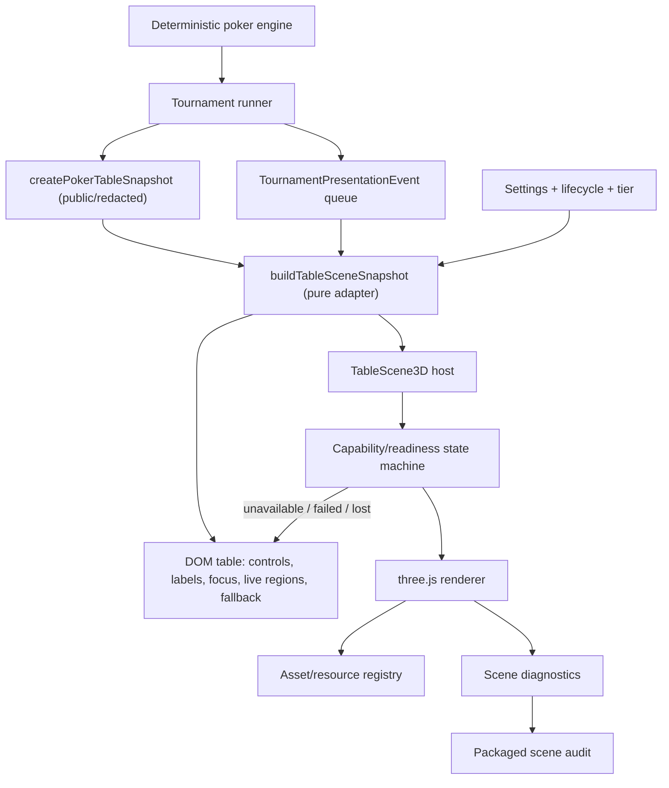

# Desktop 3D implementation plan

Status: execution plan, not an implementation-completion record

Baseline inspected: `main` at `5809808` on 2026-07-28

Decision record: [`desktop-3d-architecture.md`](./desktop-3d-architecture.md)

Backlog owners: E09, E10, E27-014, with E05, E20, E23, E24, and E25 as
cross-cutting dependencies

## 1. Purpose and non-negotiable boundaries

This document turns the accepted three.js/WebGL2 decision into an executable
plan. It does not replace the decision record, does not mark any production
milestone complete, and does not authorize a second poker engine inside the
renderer.

The finished desktop path must:

- render an original, authored championship room and playable table with real
  perspective;
- consume the existing deterministic public presentation stream instead of
  simulating poker or inferring transitions;
- keep the existing DOM table mounted as the interaction, accessibility,
  readable-text, and fallback surface;
- remain fully playable when WebGL2 is unavailable, context creation fails, the
  context is lost, a device is blocklisted, or safe mode disables acceleration;
- ship every runtime asset locally and pass the existing CSP, offline,
  provenance, licence, bundle, lifecycle, and packaged-build gates;
- preserve hidden-information boundaries: an opponent's appearance and physical
  gesture may depend only on public identity and public presentation state;
- provide fixed-camera and bounded-state-transition alternatives under reduced
  motion; and
- promote 3D to the default only after the 2.5D fallback and the packaged
  acceptance matrix both pass.

The canvas remains decorative (`aria-hidden`, not focusable). Visual richness is
not permission to move actions, focus, announcements, labels, or engine state
into three.js.

## 2. Repository-grounded baseline

### 2.1 What is actually present

| System | Verified implementation |
|---|---|
| Decision/dependency | `three@0.185.1` is a direct dependency. `docs/desktop-3d-architecture.md` accepts imperative three.js on WebGL2. Runtime notices and the offline URL allowlist were updated in `e08dd85`. |
| Loading | `PokerTable.tsx` lazy-imports `TableScene3D`, keeping three.js out of the initial module graph. The preview setting `spatialScene` defaults to `false`. |
| Scene host | `TableScene3D.tsx` mounts a decorative canvas, probes WebGL2, catches renderer construction failure, forwards state, and suspends/resumes the handle. It does not report capability or readiness to its parent. |
| Renderer | `tableScene.ts` creates a primitive room, four empty distant tables, one table, two lights plus ambient light, six primitive seated figures, generic cards, and generic chip piles. It owns a private `requestAnimationFrame` loop and exposes in-memory draw-call/triangle/running stats. |
| Pure scene model | `tableSceneModel.ts` supplies tested seat poses, a seated camera clamped to ±28 degrees, deal/bet/muck interpolation, and bounded chip counts. Its 21 tests pass. |
| Authoritative table snapshot | `createPokerTableSnapshot` in `tournamentSession.ts` redacts private information, supplies public seats, hero cards, public board, dealer/blind seats, acting player, inclusive pot, and live `potBreakdown`. |
| Presentation clock | `TournamentPresentationEvent` and the one-event-at-a-time runner in `tournamentRunner.ts`, coordinated by `App.tsx` and `tournamentPresentationClock.ts`, already provide deterministic button, blinds, deals, actions, collection, showdown, reveal, result, side-pot, payout, and elimination beats. Skip completes the same authoritative result. |
| DOM table | `PokerTable.tsx` remains the complete readable and operable surface: seat groups, labels, stack/bet text, cards, dealer/blind positions, side-pot explanations, action controls, live regions, camera controls, and motion tiers. |
| Appearance | `describeOpponentAppearance(playerId)` in `opponentAppearance.ts` is deterministic and structurally independent of skill/personality, but its six-cell face source repeats a face on roughly 90% of six-seat tables and has no 3D mesh/rig mapping. |
| Existing 2.5D fallback | CSS room depth, table, figures, gestures, `RoomFlythrough`, and `CareerTravel` remain usable without WebGL. They are fallback/interim surfaces, not completed 3D milestones. |
| Desktop lifecycle | Electron sends blur/minimize/suspend/lock lifecycle signals. `PokerTable` forwards pause state, and the renderer can suspend. Safe mode disables hardware acceleration. |
| Audits | Static bundle, offline/CSP, licences, packaged render/input/presentation/lifecycle/layout/network checks exist. None turns on the spatial scene and asserts canvas readiness, forced failure, context loss, or 3D performance. |
| Assets | No `.glb`, `.gltf`, meshopt, KTX2, or authored 3D source files exist. The rights ledger and validator exist, but their runtime-art inventory does not yet cover the planned 3D extensions. |

### 2.2 Material gaps and defects

1. `PokerTable` applies `data-spatial-scene="on"` when the preference is
   requested, not when the renderer is ready. The CSS then fades the felt,
   dealer, avatars, and centre pot to 6%. A failed WebGL probe or failed
   `WebGLRenderer` construction can therefore leave the fallback materially
   obscured.
2. The scene adapter passes only seat stack/bet/fold/acting, one collapsed action
   kind, total pot, and board-card count. It drops card identities, visibility,
   button/blind positions, pot lanes, event identity/progress, table tier,
   appearance, camera view, and separate camera/table motion policies.
3. Calls, bets, and raises collapse to `"bet"`; repeated identical action kinds
   need not restart because animation timing is keyed by action value rather
   than presentation-event identity. Check and win have no distinct physical
   action. Deal animates cards but not the dealer or body.
4. Physical cards are blank/generic. Community state is a count. There is no
   dealer puck, small-blind marker, big-blind marker, per-pot pile, payout
   trajectory, or explicit current-turn object.
5. Six primitive bodies exist, but there is no modular character schema,
   authored rig, clip set, deterministic near-duplicate avoidance, asset loader,
   or disposal-aware asset cache.
6. Seat poses are built once from the initial roster. The renderer has no
   explicit reconciliation for elimination, table moves, heads-up layout, or a
   new hand with the same repeated action kind.
7. The renderer uses a private continuous loop, a window resize listener, and
   scene traversal disposal. It lacks context-lost/restored handling,
   `ResizeObserver`, a resource registry, adaptive quality, a blocklist, and
   packaged diagnostics. Shared module-level card/chip resources make traversal
   disposal especially fragile.
8. `config/performance-budgets.json` has
   `largestDeferredChunkGzipMiB: 0.35`, but the accepted record explicitly names
   `sceneJavaScriptGzipMiB: 0.35` and `sceneAssetsMiB: 24`. The audit measures the
   largest deferred file rather than identifying the scene chunk and does not
   total scene assets. M0's budget policy is therefore only partially
   implemented.
9. `side-pot-formed` is emitted during result settlement, after the visual point
   at which committed chips first create a side pot. The snapshot's public
   `potBreakdown` is already available earlier, so the presentation boundary must
   be corrected without changing pot calculation.
10. The existing 3D screenshot demonstrates real perspective, but also shows
    floating DOM/3D composition conflicts, oversized primitive heads, generic
    cards, and duplicated avatar/body representation. It is evidence of a
    prototype, not M1 acceptance.

## 3. Honest milestone state: M0–M5

| Milestone | State at baseline | Evidence and missing exit conditions |
|---|---|---|
| M0 — decision, budgets, bootstrap, fallback | **Partial** | Decision, dependency, lazy import, preview setting, basic probe, and the existing 2.5D path exist. Missing: the two named scene budget keys/audits; requested-vs-ready state; forced-failure acceptance; context-loss recovery; blocklist/quality policy; packaged scene gate. The current readiness bug means fallback is not proven. |
| M1 — exact one-table vertical slice | **Partial** | A real room/table, seated camera, primitive cards/chips/bodies, six public seats, and real event integration exist. Missing: physical card identities; dealer puck; blind markers; an explicit current-turn treatment; distinct deal, check/call, bet/raise, and fold actions keyed by event; coherent DOM/canvas composition; forced-failure behavior; and packaged acceptance of one complete real hand. |
| M2 — complete six-seat table | **Partial scaffold; no M2 exit** | Six bodies and generic public-action plumbing exist. Missing: the complete gesture vocabulary, rigged/modular characters, character uniqueness, side-pot lanes, showdown/reveal/payout/cleanup continuity, elimination/table-move reconciliation, and complete table-object state. |
| M3 — championship room and tiers | **Partial prototype; no M3 exit** | Four static distant primitive tables, fog, and basic warm/cool lights demonstrate depth. Missing: populated background tables, room kit, crowd/activity, tier variants, authored lighting/materials, adaptive quality, and integrated-GPU budget evidence. Existing CSS tier variation does not vary the 3D renderer. |
| M4 — arrival and career travel in 3D | **Not implemented** | `RoomFlythrough` and `CareerTravel` are 2.5D fallback implementations. They mount as separate screens and do not travel a persistent 3D camera through the room into the table. |
| M5 — default, fallback, release acceptance | **Not implemented / dependency-blocked** | 3D defaults off. There is no packaged 3D matrix, automatic fallback telemetry, 60-minute scene soak, assistive-technology pass with the scene enabled, or default-promotion decision. M5 cannot start until M0–M4 exits and external rights/hardware gates are satisfied. |

No existing implementation checkbox is evidence of a milestone exit unless the
acceptance suite in this plan passes.

## 4. Target architecture



### 4.1 Ownership rules

- **Engine and runner own truth.** The scene never advances a street, awards a
  pot, chooses visibility, evaluates a hand, or completes an event.
- **One pure adapter owns presentation projection.** Add
  `src/scene3d/tableSceneSnapshot.ts`. Both visual layers consume compatible
  projections from the same `TrainingScenario` plus current public event. The
  adapter accepts no unredacted hand state.
- **The event id owns animation identity.** Scene transitions are keyed by
  `TournamentPresentationEvent.id`, not by action kind or React render time.
  Full motion interpolates within the event; reduced/off motion applies the same
  terminal state with a readable DOM announcement.
- **The host owns availability.** A small state machine reports
  `disabled | probing | loading | ready | failed | lost | blocked`. Only `ready`
  permits the DOM decoration fade. Failure/loss immediately restores the full
  DOM fallback without changing gameplay or focus.
- **The renderer owns graphics only.** Break `tableScene.ts` into a thin
  compositor plus room, table-object, character, camera, lifecycle, and resource
  modules. Pure math stays separately unit-testable.
- **A resource registry owns every GPU allocation.** Geometries, materials,
  textures, animation mixers, loaders, and cached GLBs have explicit retain/
  release/dispose behavior. No traversal may dispose shared global resources.
- **Diagnostics are observable.** The host exposes readiness, failure reason,
  renderer string where permitted, quality tier, draw calls, triangles, texture
  estimate, frame-time percentiles, frame-loop state, and context-loss count to a
  development/test-only DOM bridge consumed by packaged audits.

### 4.2 Target scene snapshot

The exact names may change during implementation, but the information boundary
must not:

```ts
interface TableSceneSnapshot {
  handId: string;
  event?: {
    id: string;
    kind: TournamentPresentationEvent["kind"];
    progress: number; // clock-owned, 0..1
  };
  seats: Array<{
    playerId: string;
    canonicalSeat: number;
    relativeSeat: number;
    stack: number;
    streetCommitted: number;
    totalCommitted: number;
    status: SeatPlayer["status"];
    isHero: boolean;
    isActing: boolean;
    publicCards: Card[]; // hero or legitimately revealed opponent cards only
    cardVisibility: "none" | "face-down" | "face-up";
    appearance: SceneCharacterAppearance; // derived only from public id
    gesture?: SceneGesture; // derived only from the public event/state
  }>;
  board: Card[];
  buttonSeat: number;
  smallBlindSeat?: number;
  bigBlindSeat?: number;
  pots: Array<{ id: string; kind: "main" | "side"; amount: number }>;
  camera: {
    pan: number;
    view: GameSettings["cameraView"];
    motion: GameSettings["cameraMotion"];
    autoAttention: boolean;
  };
  tableMotion: GameSettings["tableMotion"];
  reducedMotion: boolean;
  tier: CareerEventTier;
}
```

`canonicalSeat` preserves the engine/table identity. `relativeSeat` is a pure,
stable hero-relative projection used by both DOM and 3D. Do not silently
re-index from a sorted array in two different places.

## 5. Dependency plan and task specifications

Every task below is incomplete until its acceptance and test clauses pass.
“Fallback” means what remains playable if that task cannot ship; it is not
permission to weaken the criterion.

### Phase F — Correct the foundation (M0)

#### D3D-F01 — Make scene availability explicit

- **Files:** `src/components/TableScene3D.tsx`,
  `src/components/PokerTable.tsx`, `src/styles.css`; new
  `src/scene3d/sceneAvailability.ts` and tests.
- **Depends on:** accepted ADR only.
- **Steps:** define the availability state machine; probe on the actual target
  canvas; report ready only after renderer creation and first successful frame;
  report a stable reason for unsupported, constructor failure, blocked, lost,
  and disposed; drive `data-spatial-scene="ready"` from that state; restore DOM
  immediately on failure/loss; keep focus and the active decision unchanged.
- **Acceptance:** requesting 3D never fades DOM before the first successful
  frame; every failure state shows the full 2.5D table; success fades only the
  decorative elements; toggling/off/unmounting disposes once; no exception
  reaches React or the engine.
- **Tests:** component tests with injected probe/renderer for success, WebGL2
  null, throwing probe, throwing constructor, first-frame failure, unmount, and
  context loss; packaged forced-failure test.
- **Risks:** React Strict Mode double effects and a success callback after
  unmount. Guard with an attempt token and idempotent disposal.
- **Fallback:** leave the setting off and render the current 2.5D table at full
  opacity.

#### D3D-F02 — Reconcile the accepted scene budgets with the audit

- **Files:** `config/performance-budgets.json`,
  `scripts/audit-static-budgets.mjs`, build manifest handling/tests, and this
  plan only if measured ceilings require an explicit ADR amendment.
- **Depends on:** none; can run in parallel with D3D-F01.
- **Steps:** add `sceneJavaScriptGzipMiB: 0.35` and
  `sceneAssetsMiB: 24`; identify the scene entry/chunks through a stable Vite
  manifest relation rather than filename guessing; total all scene-owned GLB,
  binary, and texture assets; keep the general largest-deferred budget as a
  separate guard; emit measured values in the JSON report.
- **Acceptance:** the audit fails independently for an oversized scene JS graph
  and oversized scene asset set; an unrelated lazy chunk cannot accidentally
  satisfy or fail the scene-specific check; the initial 0.3 MiB budget remains
  unchanged.
- **Tests:** fixture-level audit tests for pass, JS overflow, asset overflow,
  missing manifest/entry, and unrelated-largest-chunk; production build plus
  `node scripts/audit-static-budgets.mjs`.
- **Risks:** hashed chunk ownership is many-to-many. Use Vite's manifest import
  graph and document whether shared chunks are charged once to every owning
  entry or to the scene only.
- **Fallback:** procedural M1 assets stay near zero while the audit is completed;
  do not add authored binary assets before this gate exists.

#### D3D-F03 — Establish one redacted scene snapshot adapter

- **Files:** new `src/scene3d/tableSceneSnapshot.ts` and tests;
  `src/components/PokerTable.tsx`; `src/types/poker.ts` only if the public
  snapshot lacks a named reusable type.
- **Depends on:** none; merge before M1 object/animation work.
- **Steps:** move hero-relative seat projection, public gesture selection, card
  visibility, button/blind/pot projection, camera/motion/tier settings, and
  appearance derivation into a pure adapter; preserve stable canonical and
  relative seat ids; make the DOM and canvas consume the same projection where
  practical; prohibit unredacted engine types in the module.
- **Acceptance:** the adapter represents every M1 object and action without
  reading opponent private cards; same public inputs produce byte-identical
  snapshots; a table move or player elimination preserves identity and yields
  deterministic seat reconciliation; Normal and Rational rendering contracts
  are identical.
- **Tests:** redaction/property tests; fixed-seed snapshot fixtures; parity tests
  for DOM labels/positions versus scene state; hero reveal and legitimate
  showdown/all-in reveal cases; heads-up through six-handed layouts.
- **Risks:** widening `TrainingScenario` can turn presentation needs into engine
  schema churn. Prefer a table-presenter input assembled from existing public
  fields.
- **Fallback:** the DOM continues consuming `TrainingScenario` directly until
  parity is demonstrated.

#### D3D-F04 — Bind animation to the existing presentation clock

- **Files:** new `src/scene3d/sceneTransition.ts` and tests;
  `src/scene3d/tableScene.ts`; `src/components/TableScene3D.tsx`;
  `src/lib/tournamentPresentationClock.ts` only for a public progress hook.
- **Depends on:** D3D-F03.
- **Steps:** map each public event id/kind to a declarative transition; derive
  progress from the existing clock; restart on event id even if action kinds
  repeat; define terminal state once and use it for full/reduced/off motion;
  pause/resume/skip through the same clock; never let renderer completion
  advance the runner.
- **Acceptance:** two consecutive calls/bets by the same seat animate twice;
  skip and reduced motion reach the same final snapshot; pause freezes without
  drift; resume does not replay completed events; no timer exists that can
  mutate poker state.
- **Tests:** pure transition tests across every event kind, repeated-kind
  regression, pause/resume, skip, reduced/off terminal parity, and deterministic
  replay hash.
- **Risks:** React renders and rAF sampling can observe different wall times.
  Pass normalized clock progress; do not start timers in `update`.
- **Fallback:** terminal-state rendering for unsupported event kinds, with the
  DOM announcement still providing the readable event.

#### D3D-F05 — Harden lifecycle, context recovery, and resource ownership

- **Files:** refactor `src/scene3d/tableScene.ts`; new
  `sceneRenderer.ts`, `sceneResources.ts`, `sceneLifecycle.ts`; reuse
  `createVisibilityAwareAnimationLoop` from
  `src/lib/visibilityWorkGate.ts`;
  `TableScene3D.tsx`.
- **Depends on:** D3D-F01, preferably D3D-F04.
- **Steps:** replace the private loop with the repository visibility-aware loop;
  use `ResizeObserver`; listen for `webglcontextlost/restored`; prevent default
  only while an in-place recovery is attempted; rebuild from the latest
  immutable snapshot or fall back; centralize allocations and idempotent
  disposal; render on demand when nothing is moving; expose loop state.
- **Acceptance:** hidden/minimized/paused scene produces zero frames; reduced
  motion renders on change only; context loss restores or falls back within a
  bounded interval; repeated mount/unmount and loss/restore do not grow resource
  counts; shared resources are disposed exactly once.
- **Tests:** fake-rAF lifecycle tests, resize tests, synthetic context events,
  allocation ledger tests, 100-mount soak, packaged minimize/restore and
  context-loss audit.
- **Risks:** a restored WebGL context invalidates all GPU resources. Prefer a
  full renderer/resource reconstruction over partial repair.
- **Fallback:** mark availability `lost`, restore DOM, and offer a non-blocking
  retry on the next table/setting toggle.

#### D3D-F06 — Add packaged scene diagnostics and the first release gate

- **Files:** new `scripts/audit-packaged-3d-scene.mjs`; diagnostics bridge in
  scene host; `package.json`; `scripts/release/run-release-verification.mjs`;
  audit result schema under `work/` only as generated evidence.
- **Depends on:** D3D-F01 and D3D-F05; D3D-F02 for budget assertions.
- **Steps:** launch an isolated packaged profile; enable the preview
  deterministically; wait for ready or a classified fallback; record context
  renderer, quality tier, first-frame time, frame percentiles, calls,
  triangles, texture estimate, loop state, console/fatal events; exercise
  camera, one event, pause/minimize, context loss, and forced WebGL failure.
- **Acceptance:** the audit fails on an invisible canvas, faded fallback,
  unclassified renderer failure, post-minimize frames, budget excess, or fatal
  renderer event; forced failure completes a legal hand using DOM only.
- **Tests:** self-test the harness against injected failing diagnostics; one
  unpacked and one packaged run on the development machine.
- **Risks:** GPU/driver strings vary and software renderers may be legitimate in
  VMs. Gate behavior and ceilings, not a vendor name; record vendor for evidence.
- **Fallback:** keep this as an opt-in preview and exclude it from default
  promotion.

### Phase A — Asset pipeline and original art prerequisites

#### D3D-A01 — Extend provenance and build handling for 3D assets

- **Files:** `config/asset-rights-ledger.json`,
  `scripts/validate-asset-rights.mjs`, `docs/asset-rights-release-policy.md`,
  Vite asset configuration, and new `art/3d/README.md`.
- **Depends on:** D3D-F02.
- **Steps:** inventory `.blend`, `.glb`, `.gltf`, `.bin`, `.ktx2`, and source
  textures; distinguish authoring sources from runtime exports; require creator,
  source path, creation date, licence/assignment, derivative notes, and export
  hash; include runtime exports in build/ASAR validation; prohibit remote URIs
  and embedded untracked data; document the acknowledgement flow.
- **Acceptance:** every shipping byte maps to a resolved ledger entry and an
  owned source; unresolved or untracked 3D art fails release verification; the
  packaged custom protocol loads all assets offline.
- **Tests:** validator fixtures for allowed, missing, unresolved, remote URI,
  changed hash, and derivative-source cases; packaged offline load.
- **Risks:** binary diffs hide provenance changes. Hash runtime exports and keep
  human-readable export manifests beside sources.
- **Fallback:** procedural primitives remain the only shippable assets.

#### D3D-A02 — Define art kit, coordinate contract, and deterministic exports

- **Files/assets:** new `art/3d/style-guide.md`,
  `art/3d/export-manifest.json`, source `.blend` files, runtime assets under
  `src/assets/scene3d/`, and an export/check script.
- **Depends on:** D3D-A01.
- **Steps:** define metres, +Y up, forward direction, origins, seat anchors,
  material palette, texture density, LOD names, rig/bone names, clip names,
  table/card/chip dimensions, lighting intent, and triangle/material limits;
  export binary glTF deterministically; add meshopt only after local decoder
  bundling and CSP/offline tests; use KTX2 only if measured memory/startup wins
  justify its decoder cost.
- **Acceptance:** a clean export reproduces stable logical manifests; all models
  load with no console warnings; transforms are identity/expected at import;
  scale matches `TABLE_HEIGHT`/seat/camera contracts; no asset exceeds its local
  material, texture, or triangle allowance.
- **Tests:** headless glTF validation, export-manifest diff, asset-budget audit,
  screenshot scale/reference board, and packaged load.
- **Risks:** checking in Blender sources increases repository size; deterministic
  binary byte identity may vary by Blender version. Pin tool versions and compare
  normalized manifest data when byte identity is not stable.
- **Fallback:** ship procedural table objects for M1 while authored character and
  room sources continue behind the same interfaces.

### Phase M1 — Exact playable vertical slice

M1 is exactly one real engine-driven hand at one table. It includes the hero and
at least one low-poly opponent, physical card identities, chips, dealer puck,
blind markers, an explicit current-turn treatment, and distinct deal,
check/call, bet/raise, and fold motion. Six-seat scaffolding may remain visible,
but it cannot substitute for the exact slice.

#### D3D-M101 — Complete the physical table-state vocabulary

- **Files:** new `sceneTableObjects.ts`, `sceneCardAtlas.ts` or procedural card
  face module; `tableSceneSnapshot.ts`; `tableScene.ts`.
- **Depends on:** D3D-F03, D3D-F05; D3D-A02 only if authored assets are used.
- **Steps:** render actual public rank/suit identities, face-down backs, board
  cards, seat stacks, committed bets, main pot, dealer puck, SB/BB markers, and
  a non-oscillating current-turn light/object; preserve exact visibility rules;
  give objects stable ids so updates reconcile rather than rebuild.
- **Acceptance:** physical objects agree with DOM text on every captured beat;
  no opponent card face appears before a legitimate public reveal; dealer and
  blinds occupy the snapshot's real seats; acting state is legible in a still
  frame and does not cover a face.
- **Tests:** card visibility matrix; DOM/scene parity assertions; button/blind
  movement; snapshot screenshots for preflop/flop/turn/river/showdown; contrast
  and occlusion checks.
- **Risks:** card text in a 3D texture can be unreadable or expensive. Use a
  compact local atlas or procedural canvas texture with a bounded cache and keep
  the DOM cards readable above it until visual acceptance.
- **Fallback:** DOM cards/labels remain at full information opacity while 3D
  furniture and objects render behind them.

#### D3D-M102 — Implement the M1 action grammar

- **Files:** new `sceneGestures.ts`; `sceneTransition.ts`; character/table-object
  modules; `PokerTable.tsx` only for adapter wiring.
- **Depends on:** D3D-F04, D3D-M101.
- **Steps:** define separate public gestures for receive/deal, check, call, bet,
  raise, fold/muck, and idle/acting; map `blinds-posted` and `bets-collected`;
  coordinate body, hand, card, and chip trajectories under one event id; make
  call visually place the required chips, bet place a new pile, and raise
  gather/push a larger pile; settle every object before the queue advances.
- **Acceptance:** a scripted real hand visibly demonstrates deal, at least one
  check or call, one bet or raise, and one fold; repeated actions replay; values
  and destinations match the authoritative next snapshot; no gesture varies
  with hidden strength.
- **Tests:** event-to-gesture exhaustive map; public-state invariance; repeated
  action ids; terminal parity; golden trajectory samples; real runner fixture.
- **Risks:** the current event duration may be too short for multi-part motion.
  Adjust the presentation duration table by event kind, preserving skip and
  minimum readable DOM feedback; do not slow the engine itself.
- **Fallback:** snap unsupported actions to the correct physical end state and
  keep the public DOM action label.

#### D3D-M103 — Make the seated camera and composition production-coherent

- **Files:** `sceneCamera.ts`, `PokerTable.tsx`, `styles.css`,
  `TableScene3D.tsx`.
- **Depends on:** D3D-F01, D3D-F03, D3D-M101.
- **Steps:** consume `cameraView` as real FOV/dolly presets; preserve ±28-degree
  bounded pan and recentre across pointer/keyboard/controller; smooth only when
  camera motion permits; optionally attend to the current actor within the
  bounded range; define which DOM visual elements remain fully visible,
  scene-ready-only, or visually hidden-but-accessible; eliminate duplicate
  avatars/furniture while retaining labels, controls, focus, and live regions.
- **Acceptance:** close/standard/wide produce measured distinct but comfortable
  views; all input methods agree; fixed mode has no camera interpolation;
  canvas and DOM read as one table at 1024×768, 1366×768, 1920×1080 and supported
  interface scales; readiness loss restores the complete DOM picture in one
  frame.
- **Tests:** camera pure tests, input parity, motion-tier tests, screenshot
  matrix, layer/occlusion audit, forced-failure capture.
- **Risks:** CSS coordinates will not perfectly project to 3D world anchors.
  Prefer a deliberate readable HUD/seat-label composition over fragile pixel
  projection; document the visual contract.
- **Fallback:** do not fade a DOM element whose 3D replacement is not accepted.

#### D3D-M104 — Prove the exact M1 hand and close M1

- **Files:** fixtures under tests, packaged 3D audit, release verification
  wiring, and generated evidence.
- **Depends on:** D3D-F06, D3D-M101–M103.
- **Steps:** add a fixed-seed runner fixture whose public sequence contains the
  required action grammar; capture every event; run full/reduced/off motion;
  repeat with WebGL forced unavailable; verify accessibility tree and focus
  order are unchanged; measure performance and budgets.
- **Acceptance:** one complete real hand passes with physical cards, chips,
  dealer, blinds, current turn, opponent, and all required action classes;
  forced failure remains completely playable; canvas is decorative; zero
  hidden-information differences; no fatal renderer errors; M0 budgets pass.
- **Tests/commands:** targeted Vitest suites; `npm run build`; static/offline/
  rights/licence audits; unpacked and packaged `audit-packaged-3d-scene`; existing
  input, lifecycle, presentation, and layout audits with the setting both on and
  forced off.
- **Risks:** one scripted hand can overfit the implementation. Pair the golden
  fixture with property coverage over many public event sequences.
- **Fallback:** retain preview-off default and record the failed criterion; do
  not rename the prototype “M1 complete.”

### Phase M2 — Full six-seat physical table

#### D3D-M201 — Build deterministic modular characters and a rig contract

- **Files/assets:** new `sceneCharacterAppearance.ts`,
  `sceneCharacters.ts`, character source/runtime assets, tests; retain
  `opponentAppearance.ts` for fallback compatibility.
- **Depends on:** D3D-A02, D3D-F05, M1 exit.
- **Steps:** define modular body/head/hair/clothing/accessory/material ids;
  derive appearance only from public player id; add a deterministic table-level
  distance allocator so seated characters are not near duplicates while replay
  stays stable; use one compatible seated rig and shared clips; map the existing
  2D descriptor deliberately rather than assuming sprite indices are meshes.
- **Acceptance:** fixed ids reproduce identical characters; a fixed roster has
  no near-duplicate faces/silhouettes under the documented distance metric;
  variation is independent of skill, personality, mode, rating, stack, and
  hidden cards; LOD swaps preserve identity.
- **Tests:** determinism, independence, 2,000-roster collision measurement,
  replay reconstruction, rig/clip validation, memory/resource soak.
- **Risks:** table-level uniqueness can make identity depend on seating order.
  Keep the base identity immutable; choose only among deterministic compatible
  variants using a canonical sorted roster and persist/version the algorithm.
- **Fallback:** procedural M1 bodies or existing 2D figures.

#### D3D-M202 — Complete public physical action clips

- **Files/assets:** character clips and `sceneGestures.ts`.
- **Depends on:** D3D-M201.
- **Steps:** add receive, peek/hold, muck, check, call, bet, raise, all-in, win/
  collect, showdown/reveal, idle/react, and elimination leave; layer hands/upper
  body over seated idle; drive only from public events; provide reduced/off
  poses; prevent face/label occlusion.
- **Acceptance:** every E10-002/E27-014 physical verb has a distinct readable
  action and correct object interaction; no foot sliding or object teleport at
  terminal state; hidden-strength invariance remains structural.
- **Tests:** clip inventory/markers, transition matrix, gesture invariance,
  multi-frame occlusion captures, reduced/off parity.
- **Risks:** clip blending can miss event deadlines. Author contact markers and
  clamp/warp only presentation time, never object truth.
- **Fallback:** terminal pose plus object motion and DOM action label.

#### D3D-M203 — Model pots, showdown, payout, cleanup, and roster continuity

- **Files:** snapshot/transition/table-object modules; potentially
  `tournamentRunner.ts` for presentation-event timing only.
- **Depends on:** D3D-M202; E05-004 public side-pot timing correction.
- **Steps:** create a pile per `potBreakdown` entry; transition committed bets to
  the correct lanes; emit/derive side-pot formation when public commitments
  create it, not only at settlement; reveal only legal hands; award each pot to
  its stated winner; clean up cards/chips; move button/blinds; reconcile
  elimination, heads-up, next hand, and table moves without remount flashes.
- **Acceptance:** inclusive pot and lane totals agree with DOM/engine at every
  event; split pots and multiple winners animate independently; folded cards
  never reveal; next hand begins from the prior terminal state; no duplicated or
  lost chips.
- **Tests:** side-pot conservation fixtures, ties/splits, all-in reveal,
  uncontested fold win, elimination, heads-up transition, next-hand continuity,
  skip at every event boundary.
- **Risks:** changing the event order can affect existing DOM timing. Keep engine
  settlement unchanged and add/correct only public presentation milestones.
- **Fallback:** snap pot lanes to public snapshot totals and use DOM explanations.

#### D3D-M204 — Close M2 on a six-seat matrix

- **Files:** packaged audit fixtures/evidence.
- **Depends on:** D3D-M201–M203.
- **Steps:** execute Normal, Rational, Timed, and Career hands from six-handed to
  heads-up; include side pot, showdown, fold win, elimination, pause, skip,
  context loss, and table move; profile memory and disposal.
- **Acceptance:** all table actions and state transitions are physical and
  readable; no identity, chip, card, or seat discontinuity; existing DOM
  accessibility/input gates remain green; scene ceilings hold.
- **Tests:** targeted integration fixtures, full packaged 3D scene audit,
  existing packaged input/presentation/lifecycle/layout suites with 3D ready and
  forced unavailable, and a repeated-hand resource soak.
- **Risks:** broad stochastic mode runs can hide an uncovered branch. Use fixed
  seeds for required cases and a separate randomized soak for breadth.
- **Fallback:** preview remains available only on hardware/quality tiers that
  pass; M1 procedural character fallback remains supported.

### Phase M3 — Authored championship room

#### D3D-M301 — Build the room kit and tier recipe

- **Files/assets:** room modular kit, `sceneRoom.ts`,
  `sceneTier.ts`, tier tests; reuse public event tier data.
- **Depends on:** D3D-A02, M2 exit.
- **Steps:** author floor/walls/ceiling, table islands, dealer stations, rails,
  signage using original Poker Training Pro expression, light fixtures, and
  background character/table anchors; create local/national/championship/world
  recipes for scale, crowd, lighting, dressing, and activity; prohibit protected
  tournament branding/trade dress.
- **Acceptance:** each tier is recognizable in blind screenshot review without
  changing gameplay geometry; multiple populated tables and warm casino
  lighting create a room, not a void; all assets are original and ledger-cleared.
- **Tests:** tier snapshot matrix, provenance gate, room collision/frustum checks,
  packaged offline load.
- **Risks:** background density can compete with table readability. Enforce
  luminance, contrast, depth-of-field/fog, and activity budgets around the hero
  table.
- **Fallback:** procedural distant tables and a sparse room recipe.

#### D3D-M302 — Add bounded background activity and adaptive quality

- **Files:** `sceneQuality.ts`, room/character LOD modules, settings/diagnostics,
  tests.
- **Depends on:** D3D-M301, D3D-F06.
- **Steps:** define high/medium/low quality from capability and measured frame
  time; cap DPR, crowd count, background clip rate, shadow casters, texture
  resolution, and distant-table detail; use hysteresis to avoid oscillation;
  freeze or greatly reduce off-focus activity; support a maintained blocklist
  only from documented failure evidence.
- **Acceptance:** target ceilings remain at ≤150 draw calls, ≤250k triangles,
  ≤128 MiB decoded scene textures, ≤8 shadow casters, desktop p95 ≤25 ms and p99
  ≤50 ms, hidden/minimized frame count zero; quality changes do not alter public
  state or foreground readability.
- **Tests:** synthetic capability profiles, quality hysteresis, 60-minute soak,
  integrated/discrete/software-renderer evidence, lifecycle audit.
- **Risks:** runtime auto-quality can make screenshots nondeterministic. Allow
  fixed quality in tests and record every automatic transition.
- **Fallback:** low tier removes background occupants/animation and shadows
  before reducing foreground table correctness.

#### D3D-M303 — Close M3 on hardware and visual acceptance

- **Files:** packaged audit configuration/fixtures, hardware-matrix report, and
  generated visual/performance evidence; production fixes belong to their
  originating M301/M302 modules.
- **Depends on:** D3D-M301–M302 and external rights/hardware availability.
- **Steps:** run visual review at all event tiers and viewport/interface scales;
  run typical laptop, low-spec integrated GPU, and discrete GPU matrices plus
  thermal soak; verify Narrator/NVDA with decorative canvas enabled.
- **Acceptance:** room criteria and all numeric budgets pass on the documented
  support matrix; no accessibility regression; unresolved hardware/rights rows
  remain explicit blockers, not skipped checks.
- **Tests:** tier screenshot matrix, packaged scene audit at fixed high/medium/
  low quality, 60-minute lifecycle/performance soak on each hardware class, and
  manual Narrator/NVDA protocol with results attached.
- **Risks:** this environment may not provide all three hardware classes or
  assistive technology. Keep the task open and record the exact unavailable
  matrix row rather than substituting the development GPU.
- **Fallback:** select the lowest passing quality or 2.5D per device.

### Phase M4 — Persistent in-room arrival and travel

#### D3D-M401 — Introduce a persistent scene host and camera route model

- **Files:** App/screen routing, new `Scene3DHost.tsx`,
  `sceneRoute.ts`, room/table camera modules.
- **Depends on:** M3 exit.
- **Steps:** mount one scene host across arrival, seated play, and career travel;
  model named camera anchors and original spline routes; preload the destination
  table while travelling; transfer control without destroying the renderer;
  keep DOM screens/focus semantics synchronized; make skip land on the same
  seated terminal state.
- **Acceptance:** arrival passes real room tables/dealer/players/stacks and
  settles at the playable hero seat without a hard cut; between-event travel
  moves to the next table/seat in the same room; skipped, reduced, and off paths
  land identically and within bounded time.
- **Tests:** route math, mount-count assertion, preload failure, skip at sampled
  route points, reduced/off, focus transfer, packaged capture.
- **Risks:** persistent canvas ownership can complicate React screen routing.
  Keep host above routes and send declarative scene modes; never retain screen
  component state inside it.
- **Fallback:** existing `RoomFlythrough` and `CareerTravel` 2.5D surfaces.

#### D3D-M402 — Close M4 transition and lifecycle acceptance

- **Files:** packaged transition fixtures/audit, release-verification wiring, and
  generated capture evidence.
- **Depends on:** D3D-M401.
- **Steps:** test first session, resumed session, ordinary next hand, table move,
  event travel, final ceremony, pause/minimize during route, scene failure
  mid-route, and app relaunch.
- **Acceptance:** no camera teleport/hard cut except explicit off-motion mode;
  no lost focus or gameplay action; fallback can take over at any route point;
  final placement ceremony remains a separate intended destination.
- **Tests:** deterministic route integration tests, skip/reduced/off terminal
  parity, mount-count and focus assertions, packaged multi-frame captures, and
  forced failure at sampled route progress values.
- **Risks:** transient route timing can make CDP capture flaky. Expose named
  route state/progress in test diagnostics and wait on state rather than sleeps.
- **Fallback:** restore the matching DOM screen at its terminal state.

### Phase M5 — Default promotion and release

#### D3D-M501 — Run the promotion matrix

- **Files:** release-verification manifest, packaged audit configuration, support
  matrix, and release evidence; no gameplay feature changes.
- **Depends on:** M0–M4 exits, all internal release gates, external hardware,
  assistive-technology, and provenance acceptance.
- **Steps:** run clean-install and upgrade profiles; all game modes; all motion,
  camera, interface-scale, and quality settings; hardware matrix; 60-minute
  soak; context loss; safe mode; forced WebGL failure; Narrator/NVDA; offline,
  CSP, licences, tamper, input, layout, lifecycle, network, and asset rights.
- **Acceptance:** every mandatory row has evidence and no open P0/P1 scene
  defect; fallback is equivalent in operability and public information; budgets
  pass with production assets; failure rates and reasons are documented.
- **Tests:** clean-install/upgrade packaged runs, full automated release
  verification, all scene-specific cases from section 6.3, hardware soaks, and
  manual assistive-technology acceptance.
- **Risks:** external matrix availability. M5 remains blocked until evidence
  exists; a calendar date is not an acceptance substitute.
- **Fallback:** continue preview-off default.

#### D3D-M502 — Promote 3D to default with reversible migration

- **Files:** storage defaults/migration, settings copy, safe mode, release notes,
  tests.
- **Depends on:** D3D-M501.
- **Steps:** make capable devices request 3D by default; retain the explicit
  2.5D preference; preserve existing user choice on migration; auto-fallback per
  session without overwriting preference; expose a clear setting/retry path;
  keep safe mode 2.5D.
- **Acceptance:** new capable profile reaches ready; new unsupported profile
  reaches full DOM fallback; upgrades retain explicit choice; repeated renderer
  failure cannot trap the user in a faded/broken view; rollback is a settings
  default change, not an engine migration.
- **Tests:** save migration matrix, capable/unsupported startup, safe mode,
  repeated failure, setting toggles, packaged clean/upgrade profiles.
- **Risks:** capability can change between sessions or after a driver update.
  Treat fallback as session state, preserve the user's preference, and never
  persist an automatic failure as an intentional opt-out.
- **Fallback:** flip default request off without removing scene code or changing
  saves.

## 6. Testing strategy

### 6.1 Fast deterministic layer

- Pure snapshot, redaction, seat mapping, camera, transition, trajectory,
  quality, resource-ledger, and appearance tests run in Vitest without WebGL.
- Every animation test compares its full-motion terminal value to reduced/off
  terminal value.
- Event mapping is exhaustive over `TournamentPresentationEvent`; a new event
  kind must fail compilation or an exhaustive test until classified.
- Privacy tests vary every opponent private card while holding public inputs
  fixed and require an identical scene snapshot/gesture stream.
- Conservation tests require chips represented in stacks, commitments, refunds,
  and pots to agree with the public engine snapshot.

### 6.2 Component/integration layer

- Inject capability and renderer factories into `TableScene3D`; do not require a
  host GPU for readiness/fallback tests.
- Assert the canvas remains decorative and the DOM action/focus/live-region
  structure remains present with 3D requested, ready, failed, and lost.
- Render real runner fixtures through `App`'s one-event queue. Do not synthesize
  a parallel scene-only hand timeline.
- Capture full/reduced/off frames at identical event boundaries.

### 6.3 Packaged layer

The new packaged scene audit augments, not replaces, the existing render, input,
presentation, lifecycle, layout, network, licence, and security gates. It must
run at least these cases:

| Case | Required evidence |
|---|---|
| Ready | first successful frame, diagnostics, coherent screenshot, operable DOM |
| Forced no-WebGL | classified fallback, full DOM opacity, complete legal hand |
| Constructor/first-frame failure | no crash, full fallback, stable focus |
| Context loss/restore | bounded recovery or classified fallback, no state loss |
| Minimize/restore | zero hidden frames, correct resumed terminal/event state |
| Reduced/off motion | fixed camera, bounded readable state updates, no idle loop |
| M1 fixed hand | every required object/action captured and values reconciled |
| M2 side pot/showdown | conservation, legal reveals, per-pot awards |
| M4 route | arrival/travel continuity, skip parity, fallback mid-route |
| Long soak | p95/p99, resource counts, memory, thermal behavior |

### 6.4 Current verification baseline

At planning time, the following existing suites pass: 21 scene-model tests plus
54 tournament-session/runner and PokerTable public-action/accessibility/camera
tests (75 tests total). This proves the existing pure geometry and public event
contracts; it does not prove canvas readiness, rendering, fallback, or any M1
exit criterion.

## 7. Execution order and parallel ownership

Use one integration owner for `PokerTable`/snapshot/event-clock boundaries. Keep
asset authors and renderer owners off those files unless coordinated.

| Wave | Primary lane | Parallel lane | Merge rule |
|---|---|---|---|
| 1 | **Tara:** D3D-F01 availability/fallback | D3D-F02 budgets | Both land before new scene assets or DOM fading changes. |
| 2 | D3D-F03 snapshot adapter | D3D-A01 provenance extensions | Adapter API reviewed by DOM, engine/privacy, and renderer owners. |
| 3 | D3D-F04 event clock | D3D-F05 lifecycle/resources | Merge transition contract before action implementation. |
| 4 | D3D-F06 packaged gate | D3D-A02 art/export contract | Gate must observe procedural M1 before binary art lands. |
| 5 | D3D-M101 table objects | D3D-M103 camera/composition after readiness API stabilizes | Avoid simultaneous edits to `PokerTable.tsx`; integration owner merges. |
| 6 | D3D-M102 action grammar | Extend packaged M1 fixture | D3D-M104 is the only M1 closure task. |
| 7 | D3D-M201 characters | D3D-M203 pot/continuity foundation | Share snapshot/event contracts; assets and pot logic otherwise separate. |
| 8 | D3D-M202 clips | M2 packaged matrix | Close through D3D-M204. |
| 9 | D3D-M301 room/tier | D3D-M302 quality after diagnostic schema exists | Hardware evidence closes D3D-M303. |
| 10 | D3D-M401 persistent host | M4 audit fixtures | Close through D3D-M402. |
| 11 | D3D-M501 promotion matrix | No feature work | D3D-M502 changes defaults only after sign-off. |

Do not parallelize two owners in `PokerTable.tsx`, `tableSceneSnapshot.ts`, or the
presentation clock. Asset source changes and pure renderer modules are safe to
parallelize once their contracts are frozen.

## 8. First execution task for Tara

**Tara starts with D3D-F01, not new art or animation.**

The first pull request should:

1. add a pure, exhaustive scene availability state machine;
2. have `TableScene3D` report probing/loading/ready/failure/loss;
3. set the DOM's spatial-ready attribute only after the first successful frame;
4. restore the full DOM fallback for null/throwing WebGL probes, renderer
   construction failure, first-frame failure, and context loss;
5. add injected component tests for those states; and
6. make no table-art, engine, event-order, or default-setting change.

Its exit demonstration is two side-by-side test captures: successful scene
readiness with intended decorative fading, and forced WebGL failure with the
complete readable/operable 2.5D table at full opacity.

## 9. Completion definitions

### M0 complete

The accepted technology/budget policy is enforced by named gates; scene
availability is explicit; first-frame failure and context loss restore a fully
operable fallback; lifecycle/resource behavior is bounded; and a packaged scene
audit proves it.

### M1 complete

One deterministic real hand at one real 3D table contains actual public card
identities, chips, dealer puck, blind markers, a clear current turn, hero plus at
least one opponent, and distinct deal, check/call, bet/raise, and fold motion.
DOM accessibility/input remains authoritative. Full/reduced/off motion and
forced WebGL failure all reach the same game result. The packaged M1 audit and
all budgets pass.

### M2 complete

The full six-seat table has deterministic non-repeating modular characters and
the complete public physical-action vocabulary. Main/side pots, showdown,
payout, cleanup, elimination, table moves, heads-up, and next-hand continuity
are correct and tested across modes.

### M3 complete

The authored original championship room has populated tables, warm readable
lighting, tier variation, bounded background activity, adaptive quality, and
passing visual/performance evidence on the support hardware matrix.

### M4 complete

Arrival and between-event travel use a persistent 3D room/camera and settle
directly into the playable seat without a hard cut. Skip, reduced/off motion,
failure, pause, and resume paths converge on the same terminal state. The 2.5D
transitions remain the maintained fallback.

### M5 complete

The full packaged promotion matrix, external hardware soak, assistive-technology
acceptance, and asset-rights review pass. Capable new profiles request 3D by
default, unsupported/failed profiles get the complete 2.5D experience, existing
preferences migrate correctly, safe mode remains reliable, and rollback is
documented and tested.

Until each definition is met, its milestone remains partial or not implemented
regardless of screenshots, prototype breadth, or earlier backlog wording.
