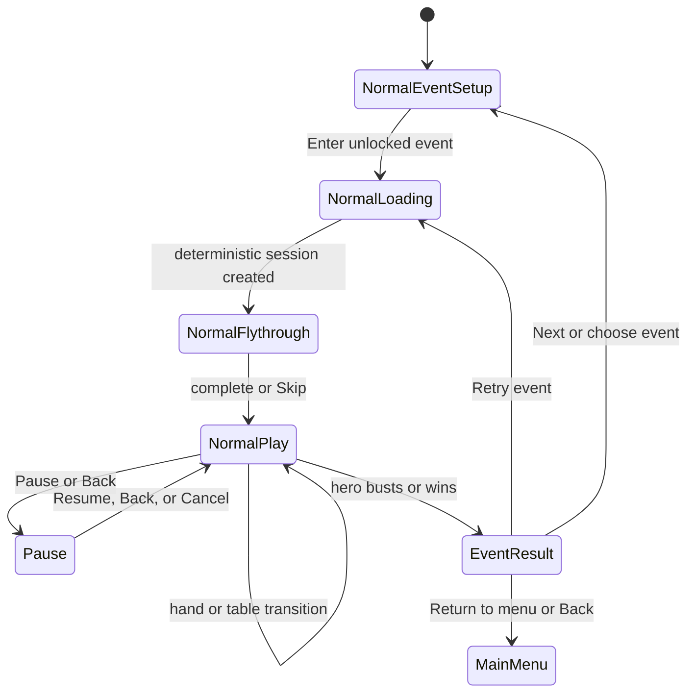
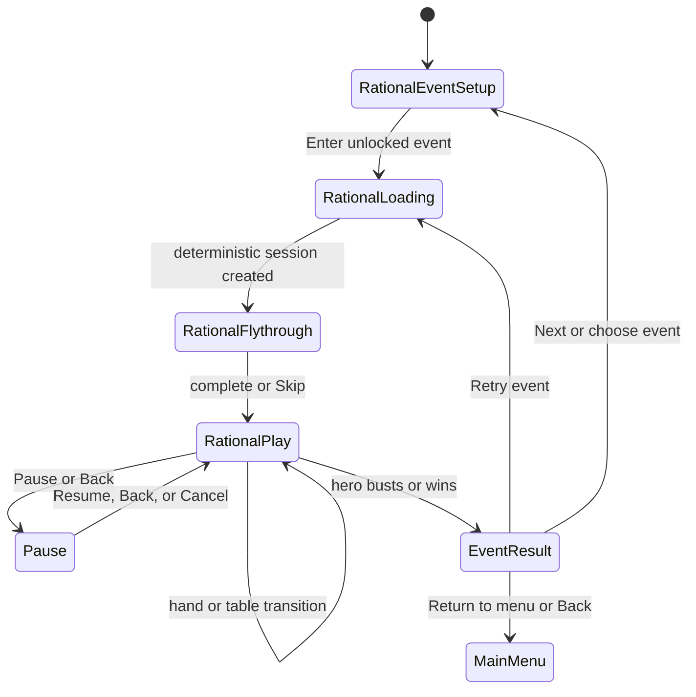
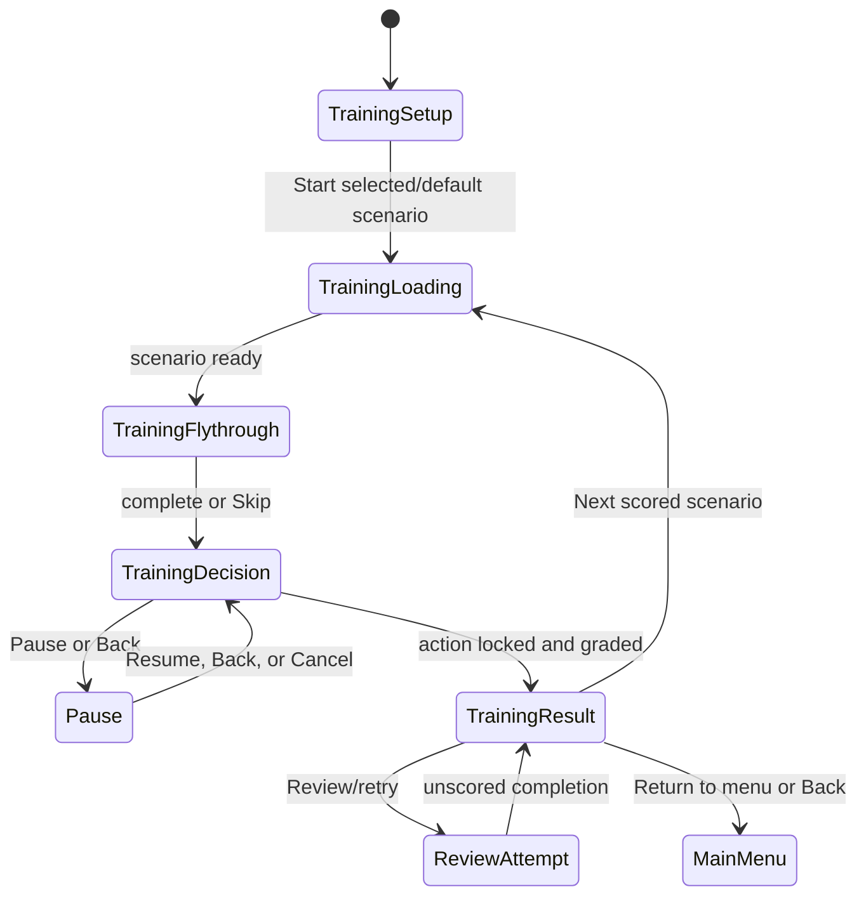
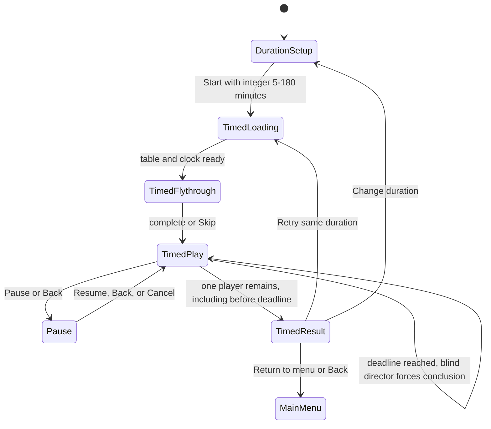
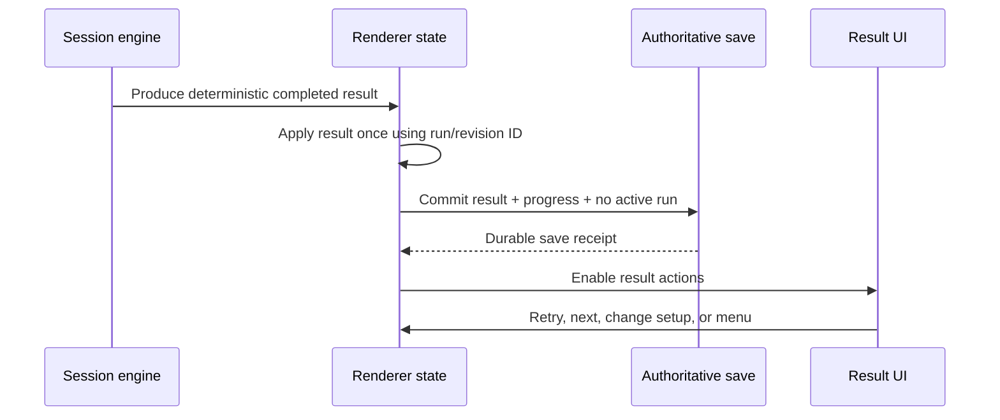

# Desktop game-state machine

Status: canonical target contract for desktop v1  
Last grounded against the repository: 2026-07-23

This document is the routing and lifecycle authority for the Windows desktop
player journey. It defines states by behavior, not by React component. Several
logical states may share one visual scene, but each state must still have the
entry, exit, persistence, and Back/Cancel behavior defined here.

## Repository facts that shape this contract

The target machine below is intentionally stricter than the current UI. It is
grounded in these current implementation facts:

- `src/App.tsx` starts directly in `home`. It has no boot probe, first-run,
  loading, fly-through, pause, recovery, or resume states.
- The current renderer reads settings and progress from `localStorage` through
  `src/lib/storage.ts`. Parse failure silently falls back to defaults.
- A versioned save envelope, migration, and last-known-good helpers exist in
  `src/lib/saveMigration.ts`, but no production renderer path calls them.
- Electron exposes `loadAutosave()` and `commitAutosave()` through
  `electron/preload.cjs`. `electron/save-store.cjs` atomically rotates a current
  and previous checksummed generation, but the renderer does not call either
  API.
- Training is the only playable UI route. Selecting it mounts `PokerTable`
  immediately. A completed action updates Training progress and writes it to
  `localStorage`; "Review hand" resets the same scenario after the scored result
  has already been recorded.
- The table's Pause button has no handler. Escape either closes the raise
  composer or immediately invokes `onExit`; no pause or abandon confirmation
  exists.
- Normal and Rational reach `TourLobby`, but `App.tsx` does not pass
  `onStartEvent`. The start button is therefore disabled and reads
  "Tournament table connection pending".
- `src/modes/tournamentSession.ts` already provides a deterministic six-seat
  session controller and event result model for Normal and Rational, but no
  reachable UI runner owns it.
- Timed Table validates 5-180 minutes, then routes to `TimedTablePending`, whose
  copy says the live runner is not wired. The deterministic blind director in
  `src/modes/timedBlindDirector.ts` is not connected to a table session.
- `TournamentCeremony` is implemented, but `tournamentResult` is never set.
  `tourResults` is initialized empty and has no setter, so event results and
  unlocks cannot currently persist.
- Electron exposes `desktop.quit()`, but the current main menu has no Quit
  action.

These are implementation gaps, not alternate allowed paths. Desktop v1 must
implement the canonical target machine below.

## State data contract

Navigation must be a discriminated state, not an unrelated collection of
booleans. The concrete names may differ, but it must be possible to serialize
the equivalent of:

```ts
type DesktopGameState =
  | { kind: "boot"; phase: "probing" }
  | { kind: "first-run"; step: "offer" | "accessibility" | "controls" }
  | { kind: "recovery"; reason: RecoveryReason }
  | { kind: "resume-offer"; snapshot: SessionSnapshot }
  | { kind: "menu" }
  | { kind: "settings"; returnTo: "menu" | "pause" | "first-run" }
  | { kind: "mode-select" }
  | { kind: "mode-setup"; setup: ModeSetup }
  | { kind: "loading"; launch: LaunchRequest; progress: number }
  | { kind: "flythrough"; launch: LaunchRequest }
  | { kind: "seated"; session: LiveSession }
  | { kind: "pause"; session: LiveSession; reason: "player" | "lifecycle" }
  | { kind: "resume-ready"; session: LiveSession }
  | { kind: "result"; result: CompletedResult }
  | { kind: "confirm"; intent: ConfirmIntent; returnTo: DesktopGameState }
  | { kind: "fatal-load"; launch: LaunchRequest; error: RecoverableError };
```

The persisted `SessionSnapshot` must identify, at minimum:

- save format, save version, engine/content version, and policy version;
- mode and complete mode configuration;
- run/session ID and deterministic seed;
- public action log and blind schedule;
- current hand, street, actor, legal actions, public board, pot, stacks, bets,
  button, and elapsed active time;
- the hero's private cards, stored only in the authoritative save;
- tournament/event progress or Timed Table deadline state, when applicable;
- Training attempt/scenario and whether it is scored or an unscored review;
- camera position, presentation speed, pause reason, and last safe boundary;
- committed progress/result revision so a recovered result cannot be awarded
  twice.

Ordinary hand-history and diagnostic exports must remain redacted. They must
not expose opponent hole cards, the future deck, or a production server seed.

## Canonical top-level machine

```mermaid
stateDiagram-v2
    [*] --> ColdStart
    ColdStart --> PersistenceProbe: renderer ready

    PersistenceProbe --> FirstRunOffer: no save and no completion marker
    PersistenceProbe --> MainMenu: valid save, no active run
    PersistenceProbe --> ResumeOffer: valid save contains active run
    PersistenceProbe --> Recovery: invalid current save or migration/read failure

    FirstRunOffer --> FirstRunSetup: Configure
    FirstRunOffer --> MainMenu: Skip
    FirstRunSetup --> MainMenu: Finish
    FirstRunSetup --> FirstRunOffer: Back

    Recovery --> PersistenceProbe: Retry read
    Recovery --> MainMenu: Restore valid previous/LKG
    Recovery --> FreshStartConfirm: Start fresh
    Recovery --> QuitApp: Back or Cancel
    FreshStartConfirm --> MainMenu: Confirm and archive corrupt generations
    FreshStartConfirm --> Recovery: Cancel

    ResumeOffer --> LoadingResume: Resume
    ResumeOffer --> AbandonRecoveredConfirm: Start over
    ResumeOffer --> QuitApp: Back or Cancel
    AbandonRecoveredConfirm --> MainMenu: Confirm abandon
    AbandonRecoveredConfirm --> ResumeOffer: Cancel
    LoadingResume --> ResumeReady: restored and validated
    LoadingResume --> Recovery: restore validation failed
    ResumeReady --> SeatedPlay: player selects Ready

    MainMenu --> ModeSelect: Play
    MainMenu --> SettingsMenu: Settings
    MainMenu --> QuitConfirm: Quit or Back
    SettingsMenu --> MainMenu: Back or Cancel
    QuitConfirm --> QuitApp: Confirm
    QuitConfirm --> MainMenu: Cancel

    ModeSelect --> NormalSetup: Normal
    ModeSelect --> RationalSetup: Rational
    ModeSelect --> TrainingSetup: Training
    ModeSelect --> TimedSetup: Timed Table
    ModeSelect --> MainMenu: Back or Cancel

    NormalSetup --> LoadingNew: Start unlocked event
    RationalSetup --> LoadingNew: Start unlocked event
    TrainingSetup --> LoadingNew: Start scenario
    TimedSetup --> LoadingNew: Start valid duration
    NormalSetup --> ModeSelect: Back or Cancel
    RationalSetup --> ModeSelect: Back or Cancel
    TrainingSetup --> ModeSelect: Back or Cancel
    TimedSetup --> ModeSelect: Back or Cancel

    LoadingNew --> Flythrough: assets and session ready
    LoadingNew --> LoadFailure: recoverable load failure
    LoadingNew --> ModeSetupReturn: Back or Cancel
    LoadFailure --> LoadingNew: Retry
    LoadFailure --> ModeSetupReturn: Back or Cancel
    Flythrough --> SeatedPlay: complete or Skip
    Flythrough --> CancelLaunchConfirm: Back or Cancel
    CancelLaunchConfirm --> ModeSetupReturn: Confirm
    CancelLaunchConfirm --> Flythrough: Continue
    ModeSetupReturn --> NormalSetup: Normal launch
    ModeSetupReturn --> RationalSetup: Rational launch
    ModeSetupReturn --> TrainingSetup: Training launch
    ModeSetupReturn --> TimedSetup: Timed launch

    SeatedPlay --> PauseMenu: Pause or Back
    SeatedPlay --> LifecyclePause: blur, minimize, lock, or suspend
    LifecyclePause --> ResumeReady: active clocks stopped and safe-save complete
    PauseMenu --> SeatedPlay: Resume, Back, or Cancel
    PauseMenu --> LeaveRunConfirm: Quit to Menu
    PauseMenu --> QuitDesktopConfirm: Quit Desktop
    LeaveRunConfirm --> MainMenu: Confirm after save/abandon policy
    LeaveRunConfirm --> PauseMenu: Cancel
    QuitDesktopConfirm --> QuitApp: Confirm after save
    QuitDesktopConfirm --> PauseMenu: Cancel

    SeatedPlay --> TrainingResult: scored Training decision complete
    SeatedPlay --> EventResult: Normal or Rational event complete
    SeatedPlay --> TimedResult: Timed Table placement complete

    TrainingResult --> LoadingNew: Next scored scenario
    TrainingResult --> SeatedPlay: Review/retry unscored
    TrainingResult --> MainMenu: Return to menu or Back
    EventResult --> LoadingNew: Retry same scored event
    EventResult --> NormalSetup: Next/choose event in Normal
    EventResult --> RationalSetup: Next/choose event in Rational
    EventResult --> HandReview: Review this round
    EventResult --> MainMenu: Return to menu or Back
    HandReview --> EventResult: Back
    HandReview --> MainMenu: Back when the ceremony has been dismissed
    TimedResult --> LoadingNew: Retry same duration as new scored run
    TimedResult --> TimedSetup: Change duration
    TimedResult --> MainMenu: Return to menu or Back

    QuitApp --> [*]
```



`ModeSetupReturn` is a routing junction, not a visible screen. It returns to the
setup state stored in the launch request. A cancelled launch must not create a
career result, Elo change, Training attempt, or partially active run.

## Four mode contracts

### Normal



- Setup owns `mode: "normal"`, selected unlocked `eventId`, hero identity/rating,
  career results, and a fresh deterministic seed.
- A retry is a new scored session with a new run ID. It must not overwrite the
  completed event result until the retry itself finishes.
- Ordinary hand and table transitions remain inside seated play. Only event
  completion opens the placement/qualification/Elo/unlock ceremony.

### Rational



- Setup and result behavior match Normal, with `mode: "rational"`.
- The resumed policy must remain information-set safe. A recovery snapshot may
  restore engine-private state, but no policy call may receive opponent cards or
  future deck state.

### Training



- `TrainingSetup` may be a logical state on the mode-select scene; it need not
  add a separate page. It must resolve the scenario, scored/review status, and
  seed before launch.
- A scored attempt is committed exactly once when its result becomes visible.
- "Review/retry" is explicitly unscored and must not change Elo, streak,
  completion count, or saved result history. "Next scored scenario" creates a
  new attempt ID.

### Timed Table



- Setup owns duration, normal-opponent policy, no-career-progression flag, a
  fresh run ID, seed, and starting active-time clock.
- Only active seated time advances the deadline. Loading, fly-through, pause,
  blur, minimize, suspend, and resume recap time do not count.
- The run can finish before the deadline. At/after the deadline, the existing
  blind director's forced-pressure behavior continues until placement is final.
- The result awards Tournament Elo exactly once and never advances/unlocks the
  Normal/Rational career circuit.

## Back, Cancel, close, and retry transition table

Every input surface (mouse, keyboard, and later controller) must resolve Back
and Cancel through this table. A modal consumes Back before its parent state.

| Current state | Back / Escape | Cancel button | Window close / OS quit | State or effect |
|---|---|---|---|---|
| First-run offer | Skip first run | Skip first run | Persist completed steps, then quit | Main menu or process exit |
| First-run accessibility/controls | Previous step | Previous step | Persist completed steps, then quit | Previous first-run step or exit |
| Recovery | Quit; never silently reset | Quit | Quit | Process exit |
| Fresh-start confirmation | Reject fresh start | Reject fresh start | Quit | Recovery or exit |
| Resume offer | Quit; never abandon run | Quit | Quit | Process exit |
| Abandon recovered run confirmation | Keep recovered run | Keep recovered run | Quit with snapshot intact | Resume offer or exit |
| Main menu | Open Quit confirmation | N/A | Open Quit confirmation when interactive | Quit confirmation |
| Settings from menu | Save settings and return | Same | Persist settings, then quit | Main menu or exit |
| Mode selection | Return to main menu | Same | Persist clean state, then quit | Main menu or exit |
| Any mode setup | Return to mode selection | Same | Persist clean state, then quit | Mode selection or exit |
| Loading | Cancel launch | Same | Cancel launch, remove incomplete run, quit | Originating setup or exit |
| Load failure | Return to originating setup | Same | Quit | Originating setup or exit |
| Fly-through | Open cancel-launch confirmation | Same | Safe-save initialized run, then quit | Confirmation or exit |
| Seated play, raise/bet composer open | Close composer only | Close composer | Safe-save, then close policy | Seated play or exit |
| Seated play, no child overlay | Open Pause | Open Pause | Safe-save, then close policy | Pause or exit |
| Pause root | Resume | Resume | Safe-save, then close policy | Seated play or exit |
| Settings/controls/reference from Pause | Return to Pause | Same | Safe-save, then close policy | Pause or exit |
| Leave-run confirmation | Keep playing | Keep playing | Safe-save and quit, preserving resumable run unless OS forbids | Pause or exit |
| Resume-ready recap | Stay paused | Stay paused | Snapshot remains resumable; quit | Resume-ready or exit |
| Training result | Return to main menu after save receipt | Same | Finish save, then quit | Main menu or exit |
| Normal/Rational event result | Return to main menu after save receipt | Same | Finish save, then quit | Main menu or exit |
| Hand review | Return to the event result, or the menu once it is dismissed | Same | Abort derivation; nothing to save (annotations are ephemeral), then quit | Event result, main menu, or exit |
| Timed result | Return to main menu after save receipt | Same | Finish save, then quit | Main menu or exit |
| Quit confirmation | Do not quit | Do not quit | Confirm quit | Prior state or exit |

Rules:

1. Back never discards a scored run, corrupt save, or uncommitted result.
2. The first Back closes the topmost transient UI: bet composer, dialog,
   settings, controls, or reference. It does not leak through to the parent.
3. Leaving seated scored play requires wording that says whether the run will be
   saved for resume or abandoned. "Quit to Menu" cannot be ambiguous.
4. A result screen may return directly because the result must already have a
   durable save receipt before its actions become enabled.
5. Retry from a completed result always creates a new run/attempt ID. It cannot
   mutate the already committed result.

### HandReview

Entered from the event-result ceremony's **Review this round** action, which
appears only when a replay for the completed round is available.

- **Derived, never stored.** The screen replays the round's stored envelope and
  recomputes each hero decision on demand. Annotations are ephemeral; only
  aggregates are eligible to persist, so leaving needs no save boundary.
- **Cancellation is required, not optional.** Derivation runs equity
  simulations per decision. Back aborts the in-flight derivation at the next
  decision boundary rather than letting an abandoned round finish computing.
- **Redaction is reapplied.** Reconstruction from a seed could in principle
  recover every player's cards. Each decision passes through
  `createInformationSet(..., heroId)`, so the review can only show what the
  player could legitimately see at that moment.
- **Fails closed on version drift.** A replay recorded by a different engine,
  content, or policy version is refused rather than reconstructed into a
  different hand and presented as the one that was played.
- **Mid-review quit/background** follows the ordinary lifecycle policy: there is
  no uncommitted state, so the pause/suspend path simply aborts derivation.

## Persistence and recovery protocol

### Required safe boundaries

Commit an authoritative file save:

- after first-run completion or skip;
- after any persisted settings change;
- immediately after a scored player action;
- after every completed hand;
- after a blind-level/director change that affects future play;
- when entering player pause or lifecycle pause;
- before showing a result;
- after applying Elo, qualification, unlocks, or Training progress;
- before returning to the menu from a run/result;
- before close, Windows session end, suspend, or update installation when the
  platform gives the app time.

An action-boundary save and a hand-boundary save must carry an idempotency
revision. Replaying the same revision after a crash must not double-award a pot,
result, Elo change, or unlock.

### Startup decision

1. Read and validate the checksummed current generation.
2. If current is invalid, validate the previous generation.
3. Migrate only supported versions through the save-envelope migration.
4. If a valid active snapshot exists, show Resume Offer; do not auto-run clocks.
5. If no valid generation exists but corrupt/read-failed data does, show
   Recovery; do not silently load defaults.
6. Only a confirmed Fresh Start may archive/replace corrupt generations.
7. Legacy `localStorage` is a one-time import source. Once a file save commits,
   file storage becomes authoritative.

### Lifecycle pause

On blur, minimize, screen lock, suspend, or renderer loss:

1. stop AI, Training, Timed Table, animation, and audio clocks;
2. capture the exact decision and camera state;
3. commit or retain the last confirmed safe snapshot;
4. show a non-interactive paused state while hidden;
5. on focus, show Resume Ready with a short recap;
6. advance clocks only after the player selects Ready.

## Result commit order

For all modes, completion is a transaction:



If the save fails, the result remains visible but its navigation actions are
replaced by Retry Save, Export Diagnostics, and Quit With Recovery Snapshot.
The player must never be sent to the menu as if the result had committed.

## Current-state gap map

| Canonical capability | Current evidence | Current status |
|---|---|---|
| Boot probe / first run | `App.tsx` initializes `screen` to `home` | Missing |
| Validated file restore | Electron APIs exist; renderer has no caller | Engine/IPC only |
| Recovery choices | No recovery component or route | Missing |
| Main menu Play/Settings | `HomeView` and `App.tsx` routes | Present |
| Main menu Quit | IPC exists; no menu action | Missing |
| Four mode selection | `ModeSelect` | Present |
| Normal/Rational setup | `TourLobby` lists/selects events | Partial |
| Normal/Rational launch | `onStartEvent` omitted by `App.tsx` | Blocked placeholder |
| Training launch | Direct mount of `PokerTable` | Playable, bypasses loading |
| Timed setup | 5-180 minute validation | Present |
| Timed launch | `TimedTablePending` | Blocked placeholder |
| Loading / fly-through | No route/component | Missing |
| Pause | Decorative button only; Escape exits | Missing |
| Event results | Component exists; result is never assigned | Unreachable |
| Training result | Feedback appears after action | Present per scenario |
| Retry semantics | Review resets a previously scored scenario | Unsafe/ambiguous |
| Durable save / recovery | `localStorage` production path; file journal unused | Missing |
| Resume exact decision | No persisted live session | Missing |
| Return to menu | Training Leave works; other modes cannot play | Partial |

This table is descriptive only. Completion is determined by
`docs/desktop-v1-vertical-slice-gate.md`.
